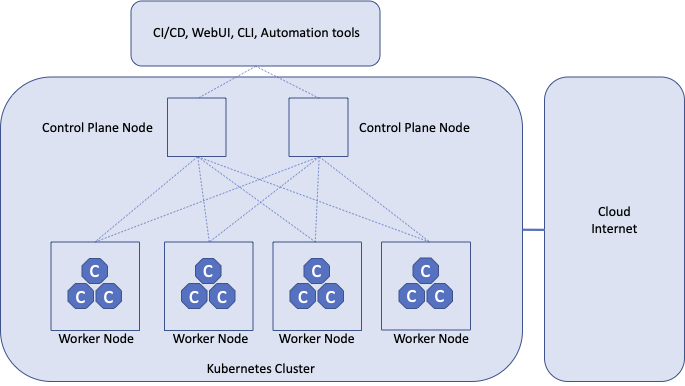
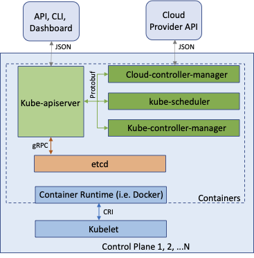
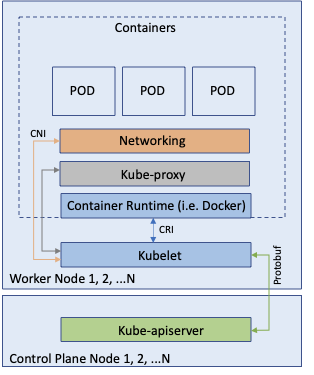
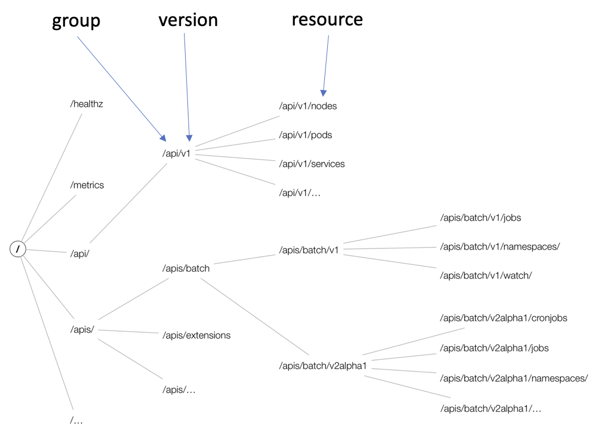
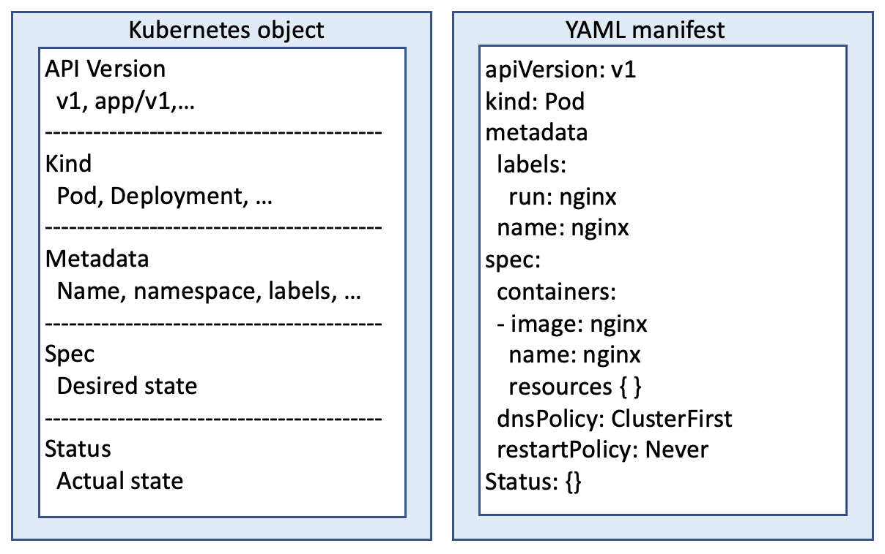

# Kubernetes overview

Kubernetes is a portable, extensible and open source platform for managing containerized workloads and services, that facilitates both declarative configuration and automation.
It takes care of scaling and failover for your workload, provides deployment patterns, and more. For example, Kubernetes can easily manage a canary deployment for your application. For detailed information about Kubernetes please refer to the online documentation at <https://kubernetes.io/docs/home/>. The main purpose of Kubernetes is to manage containerized applications, not machines or servers.

## Kubernetes Components

A Kubernetes cluster consists of a set of worker machines, called nodes, that run containerized applications. Every cluster has at least one worker node.

The worker node(s) host the Pods that are the components of the application workload. The control plane manages the worker nodes and the Pods in the cluster. In production environments, the control plane usually runs across multiple computers and a cluster usually runs multiple nodes, providing fault-tolerance and high availability.

### Control Plane Components

The control plane's components make global decisions about the cluster (for example, scheduling), as well as detecting and responding to cluster events (for example, starting up a new pod when a deployment's replicas field is unsatisfied).

- kube-apiserver: the API server is a component of the Kubernetes control plane that exposes the Kubernetes API.

- etcd: consistent and highly-available key value store used as Kubernetes' backing store for all cluster data.

- kube-scheduler: control plane component that watches for newly created Pods with no assigned node, and selects a node for them to run on. Kubernetes does not deploy containers directly on the worker nodes but Pods. Pods encapsulate containerized processes and are scheduled, scale up/down, failover by Kubernetes. Pods includes specification and metadata to indicate how to run the containers with which privileges and variables, and how to schedule them and check their readiness and liveness.

- kube-controller-manager: control plane component that runs controller processes. Deployment Controller is an example of controller process and it is responsible to create and manage the lifecycle of the replicated Pods.

- cloud-controller-manager: a Kubernetes control plane component that embeds cloud-specific control logic, like for example configuring an AWS Load-balancer.

### Node Components

Node components run on every node, maintaining running pods and providing the Kubernetes runtime environment.

- kubelet: an agent that runs on each node in the cluster. It makes sure that containers are running in a Pod.

- container runtime: the container runtime is the software that is responsible for running containers like containerd (Docker) or CRI-O.

## The Kubernetes API

The core of Kubernetes' control plane is the API server. The API server exposes an HTTP API that lets end users, different parts of your cluster, and external components communicate with one another.

The Kubernetes API lets you query and manipulate the state of API objects in Kubernetes (for example: Pods).

Most operations can be performed through the kubectl command-line interface or other command-line tools, such as kubeadm, which in turn use the API. However, you can also access the API directly using REST calls. Please refer to <https://kubernetes.io/docs/reference/using-api/client-libraries/> for the existing client libraries.

### API versioning

Different API versions indicate different levels of stability and support. The different levels are:

- Alpha: The version names contain alpha (for example, v1alpha1). The software is recommended for use only in short-lived testing clusters, due to increased risk of bugs and lack of long-term support.
- Beta: The version names contain beta (for example, v2beta3). The software is not recommended for production uses. Subsequent releases may introduce incompatible changes. If you have multiple clusters which can be upgraded independently, you may be able to relax this restriction.
- Stable: The version name is vX where X is an integer. The stable versions of features appear in released software for many subsequent versions.

### API groups

API groups make it easier to extend the Kubernetes API. The API group is specified in a REST path and in the apiVersion field of a serialized object.

There are several API groups in Kubernetes:

- The core (also called legacy) group is found at REST path /api/v1. The core group is not specified as part of the apiVersion field, for example, apiVersion: v1.
- The named groups are at REST path `/apis/$GROUP_NAME/$VERSION` and use apiVersion: `$GROUP_NAME/$VERSION` (for example, apiVersion: `batch/v1`). You can find the full list of supported API groups in Kubernetes API reference (<https://kubernetes.io/docs/reference/generated/kubernetes-api/v1.25/#-strong-api-groups-strong->).

## Kubernetes Primitives

A Kubernetes primitive is the equivalent of a class in object oriented programming. The instance of a class is an object, managing its own state and having the ability to communicate with other parts of the system. Whenever you create a Kubernetes object, you produce an instance of the primitive.
For example, a Pod in Kubernetes is the class of which there can be many instances with their own identity (name, environment variables, resources requirements...).
Every Kubernetes object has a system-generated unique identifier (also known as UID) to clearly distinguish between the instances.

Each and every Kubernetes primitive follows a general structure, which you can observe if you have a deeper look at a manifest of an object, as shown in the below picture.

The primary markup language used for a Kubernetes manifest is YAML.

