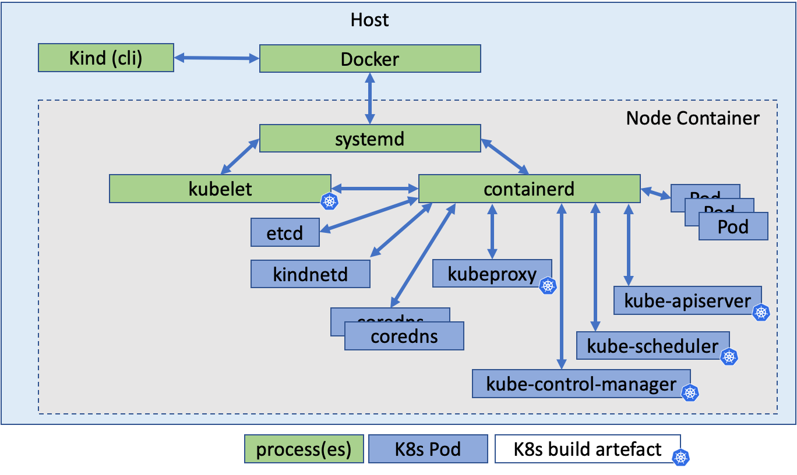

# Getting Started

This lab is based on `kind` Kubernetes installer. `kind` or **k**ubernetes **in** **d**ocker is a suite of tooling for local Kubernetes “clusters” where each “node” is a Docker container. `kind` is targeted at testing Kubernetes and is also very convenient for trainings.
`kind` is divided into go packages implementing most of the functionality, a command line for users, and a “node” base image. Please refer to <https://kind.sigs.k8s.io/> for more information.



## Task 1. Install Docker

As Kind is using Docker we need to install it on the host.

Please run the following

```bash
sudo apt update && sudo apt install docker.io -y
```

You should have an output similar to:

```console
Hit:1 http://us-west-2.ec2.archive.ubuntu.com/ubuntu jammy InRelease
Get:2 http://us-west-2.ec2.archive.ubuntu.com/ubuntu jammy-updates InRelease [114 kB]
...
No VM guests are running outdated hypervisor (qemu) binaries on this host.
```

Allow the user ubuntu to run docker:

```bash
sudo usermod -aG docker $USER && newgrp docker
```

and restart the web terminal demon to take changes into account for all terminal sessions:

```bash
sudo service ttyd restart
```

You should notice the web terminal is restarted.

## Task 2. Install Kind

Run the following commands to install Kind:

```bash
curl -Lo ./kind https://kind.sigs.k8s.io/dl/v0.16.0/kind-linux-amd64
chmod +x ./kind
sudo mv ./kind /usr/bin/kind
```

You should have an output similar to:


```console
  % Total    % Received % Xferd  Average Speed   Time    Time     Time  Current
                                 Dload  Upload   Total   Spent    Left  Speed
100    97  100    97    0     0    509      0 --:--:-- --:--:-- --:--:--   510
  0     0    0     0    0     0      0      0 --:--:-- --:--:-- --:--:--     0
100 6716k  100 6716k    0     0  6658k      0  0:00:01  0:00:01 --:--:-- 26.6M
```

## Task 3. Install Kubectl

Kubernetes provides a command line tool named `kubectl` for communicating with a Kubernetes cluster's control plane, using the Kubernetes API. For more information please refer to <https://kubernetes.io/docs/reference/kubectl/>.

Run the following to install `kubectl`:

```bash
sudo snap install kubectl --classic
```

You should have an output similar to:

```console
kubectl 1.25.1 from Canonical✓ installed
```

In order to get completion for kubectl command let's install the kubectl completion script:

```bash
echo 'source <(kubectl completion bash)' >>~/.bashrc
exec bash
```

## Task 4. Define Kubernetes Cluster config file

Prepare cluster configuration file, we will use 3x Nodes cluster with one Control Plane and 2x Workers as well as Calico CNI:

```bash
cat > kind-config.yaml <<EOF                           
kind: Cluster
apiVersion: kind.x-k8s.io/v1alpha4
nodes:
- role: control-plane
- role: worker
- role: worker
networking:
  disableDefaultCNI: true # disable the default Kindnet CNI
  podSubnet: 192.168.0.0/16 # set to Calico's default subnet
EOF
```

## Task 5. Deploy Kubernetes cluster

In this lab we install a Kind cluster with Kubernetes v1.23, run the following command to deploy the cluster:

```bash
kind create cluster --name demo --config kind-config.yaml --image="kindest/node:v1.23.10@sha256:f047448af6a656fae7bc909e2fab360c18c487ef3edc93f06d78cdfd864b2d12"
```

You should have an output similar to:

```console
Creating cluster "demo" ...
 ✓ Ensuring node image (kindest/node:v1.23.10) 🖼
 ✓ Preparing nodes 📦 📦 📦  
 ✓ Writing configuration 📜 
 ✓ Starting control-plane 🕹️ 
 ✓ Installing StorageClass 💾 
 ✓ Joining worker nodes 🚜 
Set kubectl context to "kind-demo"
You can now use your cluster with:

kubectl cluster-info --context kind-demo

Thanks for using kind! 😊
```

Check the cluster is properly installed and notice the coredns Pods are in `Pending` state until a CNI is installed:

```bash
kubectl get pods -n kube-system
```

```console
eti-lab> kubectl get pods -n kube-system
NAME                                         READY   STATUS    RESTARTS   AGE
coredns-64897985d-fjrh7                      0/1     Pending   0          100s
coredns-64897985d-pbsrq                      0/1     Pending   0          100s
etcd-demo-control-plane                      1/1     Running   0          115s
kube-apiserver-demo-control-plane            1/1     Running   0          115s
kube-controller-manager-demo-control-plane   1/1     Running   0          117s
kube-proxy-8v2fm                             1/1     Running   0          82s
kube-proxy-b9xxq                             1/1     Running   0          100s
kube-proxy-zr5dk                             1/1     Running   0          94s
kube-scheduler-demo-control-plane            1/1     Running   0          114s
```

## Task 6. Deploy Calico CNI

Install the Tigera Calico operator and custom resource definitions as well as install Calico by creating the necessary custom resource.:

```bash
kubectl create -f https://raw.githubusercontent.com/projectcalico/calico/v3.24.1/manifests/tigera-operator.yaml
kubectl create -f https://raw.githubusercontent.com/projectcalico/calico/v3.24.1/manifests/custom-resources.yaml
```

Check the Calico Pods are reaching `Ready` state and `Running` status:

```bash
watch kubectl get pods -n calico-system
```

```console
NAME                                       READY   STATUS    RESTARTS   AGE
calico-kube-controllers-7d6749878f-l6rkp   1/1     Running   0          6m5s
calico-node-248b9                          1/1     Running   0          6m5s
calico-node-95s8c                          1/1     Running   0          6m5s
calico-node-ss79f                          1/1     Running   0          6m5s
calico-typha-6688547865-7s9k6              1/1     Running   0          6m
calico-typha-6688547865-ckcwd              1/1     Running   0          6m5s
csi-node-driver-8xh6b                      2/2     Running   0          6m5s
csi-node-driver-d8fb4                      2/2     Running   0          6m5s
csi-node-driver-dbxfk                      2/2     Running   0          6m5s
```

When target state is reached press `^C` to revert back to the console.

Check the coredns Pods are `Ready` and `Running`:

```bash
kubectl get pods --namespace=kube-system
```

```console
eti-lab> kubectl get pods --namespace=kube-system
NAME                                         READY   STATUS    RESTARTS   AGE
coredns-64897985d-fjrh7                      1/1     Running   0          23m
coredns-64897985d-pbsrq                      1/1     Running   0          23m
etcd-demo-control-plane                      1/1     Running   0          23m
kube-apiserver-demo-control-plane            1/1     Running   0          23m
kube-controller-manager-demo-control-plane   1/1     Running   0          23m
kube-proxy-8v2fm                             1/1     Running   0          22m
kube-proxy-b9xxq                             1/1     Running   0          23m
kube-proxy-zr5dk                             1/1     Running   0          22m
kube-scheduler-demo-control-plane            1/1     Running   0          23m
```

## Task 7. Check the cluster with Kind CLI

```bash
kind get clusters
```

You should have a similar output.

```console
demo
```

```bash
kind get nodes --name demo
```

You should have a similar output.

```console
demo-control-plane
demo-worker
demo-worker2
```

## Task 8. Check Kubectl config and current context

```bash
kubectl config current-context
```

You should have a similar output.

```console
kind-demo
```

```bash
kubectl config view
```

You should have a similar output.

```yaml
apiVersion: v1
clusters:
- cluster:
    certificate-authority-data: DATA+OMITTED
    server: https://127.0.0.1:61353
  name: kind-demo
contexts:
- context:
    cluster: kind-demo
    user: kind-demo
  name: kind-demo
current-context: kind-demo
kind: Config
preferences: {}
users:
- name: kind-demo
  user:
    client-certificate-data: REDACTED
    client-key-data: REDACTED
```

## Task 9. Check the cluster with Kubectl

`kubectl` command line interface is already installed in your lab environment. You can use `kubectl` to check the cluster has been deployed properly

```bash
kubectl cluster-info --context kind-demo
```

You should have a similar output.

```console
Kubernetes control plane is running at https://127.0.0.1:42563
CoreDNS is running at https://127.0.0.1:42563/api/v1/namespaces/kube-system/services/kube-dns:dns/proxy
```

```bash
kubectl get nodes 
```

You should have the similar output. Notice the ready state for the 3 nodes, 1 control plane and 2 workers.

```console
NAME                 STATUS   ROLES           AGE   VERSION
demo-control-plane   Ready    control-plane   11m   v1.25.0
demo-worker          Ready    <none>          11m   v1.25.0
demo-worker2         Ready    <none>          11m   v1.25.0
```

## Task 10. Check the cluster with Docker

You can use `docker` command line interface to list the containers running on the lab environment.

```bash
docker ps
```

You should have a similar output. Notice the image release used for the nodes running as containers: `kindest/node:v1.25.0`

```console
CONTAINER ID   IMAGE                  COMMAND                  CREATED          STATUS          PORTS                       NAMES
6fbf0bfd2ddb   kindest/node:v1.25.0   "/usr/local/bin/entr…"   16 minutes ago   Up 16 minutes                               demo-worker
1e2094700a37   kindest/node:v1.25.0   "/usr/local/bin/entr…"   16 minutes ago   Up 16 minutes                               demo-worker2
a7275fc08a88   kindest/node:v1.25.0   "/usr/local/bin/entr…"   16 minutes ago   Up 16 minutes   127.0.0.1:61353->6443/tcp   demo-control-plane
```

## Task 11. Check the Pods already deployed

Pods are the smallest deployable units of computing that you can create and manage in Kubernetes. A Pod (as in a pod of whales or pea pod) is a group of one or more containers, with shared storage and network resources, and a specification for how to run the containers.

Enter the below `kubectl` command to list all the Pods deployed on the cluster

```bash
kubectl get pods -A
```

You should have a similar output.

```console
NAMESPACE            NAME                                         READY   STATUS    RESTARTS   AGE
calico-apiserver     calico-apiserver-6d77f96fdd-27cvs            1/1     Running   0          113s
calico-apiserver     calico-apiserver-6d77f96fdd-md2tw            1/1     Running   0          113s
calico-system        calico-kube-controllers-7d6749878f-xxtqt     1/1     Running   0          2m37s
calico-system        calico-node-jlc5q                            1/1     Running   0          2m37s
calico-system        calico-node-sdlsk                            1/1     Running   0          2m37s
calico-system        calico-node-xm4g6                            1/1     Running   0          2m37s
calico-system        calico-typha-7fffff6c66-8h752                1/1     Running   0          2m37s
calico-system        calico-typha-7fffff6c66-z9hzf                1/1     Running   0          2m28s
calico-system        csi-node-driver-bb6lj                        2/2     Running   0          2m11s
calico-system        csi-node-driver-k5zcs                        2/2     Running   0          2m11s
calico-system        csi-node-driver-xlbgz                        2/2     Running   0          2m14s
kube-system          coredns-64897985d-67mm6                      1/1     Running   0          60m
kube-system          coredns-64897985d-fp8xq                      1/1     Running   0          60m
kube-system          etcd-demo-control-plane                      1/1     Running   0          60m
kube-system          kube-apiserver-demo-control-plane            1/1     Running   0          60m
kube-system          kube-controller-manager-demo-control-plane   1/1     Running   0          60m
kube-system          kube-proxy-d57qd                             1/1     Running   0          59m
kube-system          kube-proxy-hgrhm                             1/1     Running   0          60m
kube-system          kube-proxy-zk7r5                             1/1     Running   0          59m
kube-system          kube-scheduler-demo-control-plane            1/1     Running   0          60m
local-path-storage   local-path-provisioner-58dc9cd8d9-cj82t      1/1     Running   0          60m
tigera-operator      tigera-operator-6dcd98c8ff-t4kfm             1/1     Running   0          2m43s
```

You can notice that the Kubernetes components mentioned in the architecture section are deployed as Pods in a specific namespace named `kube-system`. In Kubernetes, namespaces provides a mechanism for isolating groups of resources within a single cluster.

The components include etcd , kube-apiserver, kube-controller-manager, kube-scheduler. In addition, few others applications are deployed like:

- coredns: it is a DNS server responsible for name resolution and integrates with Kubernetes for service discovery. With coredns, Pods in the same namespace can refer to each other only by their Pod names.
- local-path-provisioner: it provides a way for the Kubernetes users to utilize the local storage in each node. Based on the user configuration, the Local Path Provisioner will create hostPath based persistent volume on the node automatically.
- kube-proxy: it is related to the Kubernetes services configuration to expose application to the external world or other application within the cluster. It is deployed on each and every node. It can do simple TCP, UDP, and SCTP stream forwarding or round robin TCP, UDP, and SCTP forwarding across a set of backends.

From the table, the `READY` column gives an indication of how many containers are running in the Pod and how many are ready. The primary purpose of a multi-container Pod is to support co-located, co-managed helper processes for a main program like logs, metrics collection (sidecar containers) or facilitate access to external resource (reverse-proxy, adapters containers). 

The `STATUS` column indicates the Pods lifecycle status. Pods follow a defined lifecycle, starting in the `Pending` phase, moving through `Running` if at least one of its primary containers starts OK, and then through either the `Succeeded` or `Failed` phases depending on whether any container in the Pod terminated in failure.
