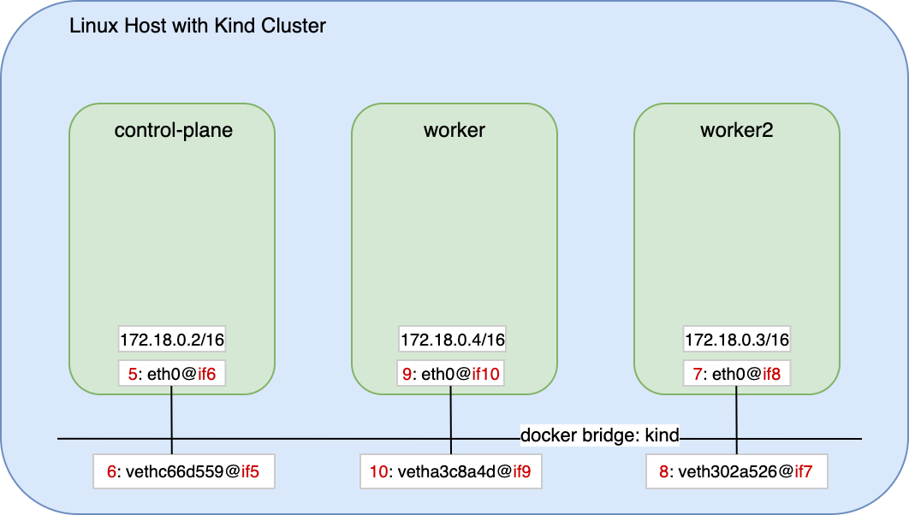
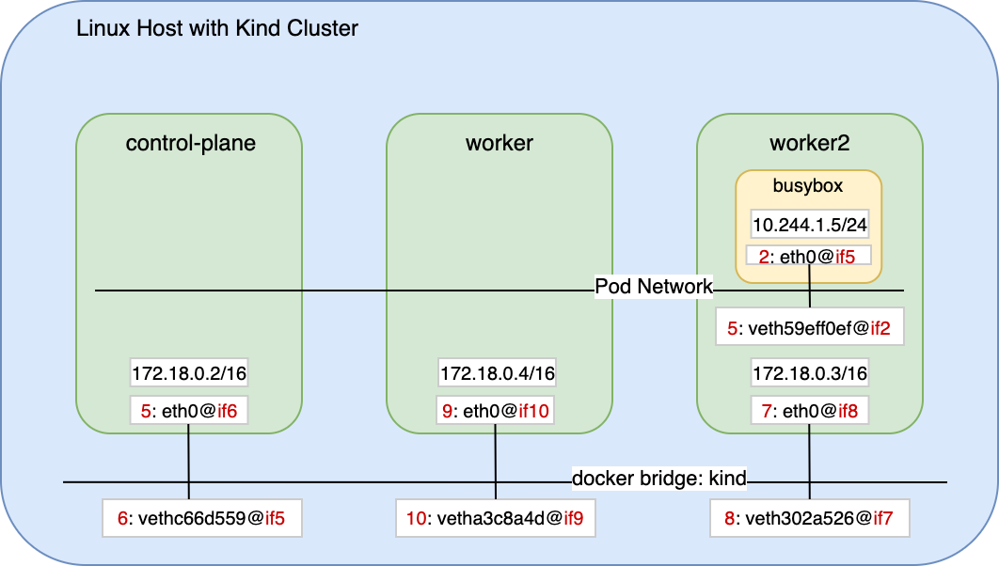

# Understanding cluster networking

That section aims to understand the cluster networking setup. Kind uses Docker (which uses containerd underneath) to deploy cluster nodes as containers on the host. Then Kubernetes will use containerd to deploy containers into those nodes/containers.

Let's understand the connectivity between the nodes.

## Task 1. Get IP addresses for nodes with Kubectl

You can get the IP addresses of the nodes with the following command:

```bash
kubectl get nodes -o wide
```

You should have a similar output.

```console
kubectl get nodes -o wide
NAME                 STATUS   ROLES           AGE   VERSION   INTERNAL-IP   EXTERNAL-IP   OS-IMAGE             KERNEL-VERSION    CONTAINER-RUNTIME
demo-control-plane   Ready    control-plane   43h   v1.25.0   172.18.0.2    <none>        Ubuntu 22.04.1 LTS   5.15.0-1019-aws   containerd://1.6.7
demo-worker          Ready    <none>          43h   v1.25.0   172.18.0.4    <none>        Ubuntu 22.04.1 LTS   5.15.0-1019-aws   containerd://1.6.7
demo-worker2         Ready    <none>          43h   v1.25.0   172.18.0.3    <none>        Ubuntu 22.04.1 LTS   5.15.0-1019-aws   containerd://1.6.7
```

You can also customize the information displayed by kubectl by filtering the json resources from the output with custom columns. For example, if you are interested in the nodes name, internal IP only, you can execute:

```bash
kubectl get nodes -o wide -o=custom-columns="NAME:metadata.name",'InternalIP:status.addresses[?(@.type == "InternalIP")].address'
```

You should have a similar output much more simpler now:

```console
NAME                 InternalIP
demo-control-plane   172.18.0.2
demo-worker          172.18.0.4
demo-worker2         172.18.0.3
```

To better understand the json structure related to kubectl command you can set the output format to json:

```bash
kubectl get nodes -o wide -o json
```

```console
eti-lab> kubectl get nodes -o wide -o json
{
    "apiVersion": "v1",
    "items": [
        {
            "apiVersion": "v1",
            "kind": "Node",
            "metadata": {
                "annotations": {
                    "kubeadm.alpha.kubernetes.io/cri-socket": "unix:///run/containerd/containerd.sock",
                    "node.alpha.kubernetes.io/ttl": "0",
                    "volumes.kubernetes.io/controller-managed-attach-detach": "true"
                },
                "creationTimestamp": "2022-10-06T05:19:01Z",
                "labels": {
                    "beta.kubernetes.io/arch": "amd64",
                    "beta.kubernetes.io/os": "linux",
                    "kubernetes.io/arch": "amd64",
                    "kubernetes.io/hostname": "demo-control-plane",
                    "kubernetes.io/os": "linux",
                    "node-role.kubernetes.io/control-plane": "",
                    "node.kubernetes.io/exclude-from-external-load-balancers": ""
                },
                "name": "demo-control-plane",
                "resourceVersion": "619657",
                "uid": "29bdf288-74d0-4c3d-89e4-e2bf6650a9a2"
            },
            "spec": {
                "podCIDR": "10.244.0.0/24",
                "podCIDRs": [
                    "10.244.0.0/24"
                ],
                "providerID": "kind://docker/demo/demo-control-plane",
                "taints": [
                    {
                        "effect": "NoSchedule",
                        "key": "node-role.kubernetes.io/control-plane"
                    }
                ]
            },
            "status": {
                "addresses": [
                    {
                        "address": "172.18.0.2",
                        "type": "InternalIP"
                    },
                    {
                        "address": "demo-control-plane",
                        "type": "Hostname"
                    }
                ],
...
   ],
    "kind": "List",
    "metadata": {
        "resourceVersion": ""
    }
}
```

## Task 2. Identify Docker networks

Let's understand where the containers for Kubernetes nodes are deployed. 

List docker networks:

```bash
docker network list 
```

You should have a similar output:

```console
NETWORK ID     NAME      DRIVER    SCOPE
dad9a11e1674   bridge    bridge    local
fc7177796920   host      host      local
b3b8b36795cb   kind      bridge    local
e0d9fda8aff8   none      null      local
```

Notice the network named `kind`. It have been created by the Kubernetes Kind installer in order to deploy the containerized cluster nodes. The other networks are configured by default when docker is installed.

Docker offers four network types, each with a different capacity for communication with other network entities.

- A. Host Networking: The container shares the same IP address and network namespace as that of the host. Services running inside of this container have the same network capabilities as services running directly on the host.
- B. Bridge Networking: The container runs in a private network internal to the host. Communication is open to other containers in the same network. Communication with services outside of the host goes through network address translation (NAT) before exiting the host. (This is the default mode of networking when the --net option isn't specified). The `kind` network is of type bridge.
- D. Container-defined Networking: A container can share the address and network configuration of another container. This type enables process isolation between containers, where each container runs one service but where services can still communicate with one another on the `localhost` address.
- E. No networking: This option disables all networking for the container.

## Task 3. Get IP addresses for nodes with Docker

Let's check the network and IP addresses allocated by Docker for the nodes.

Use docker inspect command with formatting to check associated containers and IP addresses per network:

```bash
docker inspect $(docker network list -q) -f '{{.Name}}: {{range .Containers}}({{.Name}} ; {{.IPv4Address}}), {{end}}'
```

You should have a similar output:

```console
bridge: 
host: 
kind: (demo-worker2 ; 172.18.0.3/16), (demo-worker ; 172.18.0.4/16), (demo-control-plane ; 172.18.0.2/16), 
none:
```

You can notice the 3x nodes are deployed on `kind` network with the addresses matching the output of the kubectl command run at Task 1.

Alternatively to docker CLI formatting you can use jq to filter on json output.

jq is a lightweight and flexible command-line JSON processor. You can use it to slice and filter and map and transform structured data. For more information please refer to <https://stedolan.github.io/jq/>. There is also a very convenient online version at <https://jqplay.org/>. We will use it in the rest of the lab.

Install jq with the following command:

```bash
sudo apt -y install jq
```

Then filter the docker inspect command outputs to highlight docker network name, container name and IP address:

```bash
docker inspect $(docker network list -q) | jq '.[] | (.Name +" "+(.Containers[] | (.Name+" "+.IPv4Address)))'
```

You should have a similar output:

```console
"kind demo-worker2 172.18.0.3/16"
"kind demo-worker 172.18.0.4/16"
"kind demo-control-plane 172.18.0.2/16"
```


## Task 4. Identify veth pairs between nodes and host

The interfaces of the containerized nodes are bound to virtual interface on the host using veth pairs. The veth devices are virtual Ethernet devices created in interconnected pairs.  They act as tunnels between network namespaces to create a bridge to a physical network device in another namespace.

Check the interfaces on the host:

```bash
ip address
```

You should have a similar output:

```console
1: lo: <LOOPBACK,UP,LOWER_UP> mtu 65536 qdisc noqueue state UNKNOWN group default qlen 1000
    link/loopback 00:00:00:00:00:00 brd 00:00:00:00:00:00
    inet 127.0.0.1/8 scope host lo
       valid_lft forever preferred_lft forever
    inet6 ::1/128 scope host 
       valid_lft forever preferred_lft forever
2: ens5: <BROADCAST,MULTICAST,UP,LOWER_UP> mtu 9001 qdisc mq state UP group default qlen 1000
    link/ether 0e:1d:a9:aa:66:d7 brd ff:ff:ff:ff:ff:ff
    altname enp0s5
    inet 172.31.55.147/20 metric 100 brd 172.31.63.255 scope global dynamic ens5
       valid_lft 2097sec preferred_lft 2097sec
    inet6 fe80::c1d:a9ff:feaa:66d7/64 scope link 
       valid_lft forever preferred_lft forever
3: docker0: <NO-CARRIER,BROADCAST,MULTICAST,UP> mtu 1500 qdisc noqueue state DOWN group default 
    link/ether 02:42:11:bc:fd:a0 brd ff:ff:ff:ff:ff:ff
    inet 172.17.0.1/16 brd 172.17.255.255 scope global docker0
       valid_lft forever preferred_lft forever
4: br-b3b8b36795cb: <BROADCAST,MULTICAST,UP,LOWER_UP> mtu 1500 qdisc noqueue state UP group default 
    link/ether 02:42:73:96:59:fc brd ff:ff:ff:ff:ff:ff
    inet 172.18.0.1/16 brd 172.18.255.255 scope global br-b3b8b36795cb
       valid_lft forever preferred_lft forever
    inet6 fc00:f853:ccd:e793::1/64 scope global 
       valid_lft forever preferred_lft forever
    inet6 fe80::42:73ff:fe96:59fc/64 scope link 
       valid_lft forever preferred_lft forever
    inet6 fe80::1/64 scope link 
       valid_lft forever preferred_lft forever
6: vethc66d559@if5: <BROADCAST,MULTICAST,UP,LOWER_UP> mtu 1500 qdisc noqueue master br-b3b8b36795cb state UP group default 
    link/ether be:ba:af:4e:1f:b1 brd ff:ff:ff:ff:ff:ff link-netnsid 2
    inet6 fe80::bcba:afff:fe4e:1fb1/64 scope link 
       valid_lft forever preferred_lft forever
8: veth302a526@if7: <BROADCAST,MULTICAST,UP,LOWER_UP> mtu 1500 qdisc noqueue master br-b3b8b36795cb state UP group default 
    link/ether c2:38:a7:97:6e:68 brd ff:ff:ff:ff:ff:ff link-netnsid 1
    inet6 fe80::c038:a7ff:fe97:6e68/64 scope link 
       valid_lft forever preferred_lft forever
10: vetha3c8a4d@if9: <BROADCAST,MULTICAST,UP,LOWER_UP> mtu 1500 qdisc noqueue master br-b3b8b36795cb state UP group default 
    link/ether e6:10:b1:26:e8:0d brd ff:ff:ff:ff:ff:ff link-netnsid 0
    inet6 fe80::e410:b1ff:fe26:e80d/64 scope link 
       valid_lft forever preferred_lft forever
```

In our case interfaces number 6, 8, 10 are veth interfaces connected to the Kubernetes nodes. For examples interface number 6: `vethc66d559@if5` is connected to interface number 5: on the other side (@if5 part of the interface name).

You can check that veth is linked to the interface 5: in control-plane node:

```bash
docker exec -it demo-control-plane ip addr
```

You should have a similar output:

```console
[...]
    link/ether 46:d3:0f:8e:c6:5d brd ff:ff:ff:ff:ff:ff link-netns cni-b8fea314-1e7c-19b5-ae9e-f9324ba940f0
    inet 10.244.0.1/32 scope global veth6691c639
       valid_lft forever preferred_lft forever
5: eth0@if6: <BROADCAST,MULTICAST,UP,LOWER_UP> mtu 1500 qdisc noqueue state UP group default 
    link/ether 02:42:ac:12:00:02 brd ff:ff:ff:ff:ff:ff link-netnsid 0
    inet 172.18.0.2/16 brd 172.18.255.255 scope global eth0
       valid_lft forever preferred_lft forever
[...]
```

You can notice interface 5: eth0@if6 is linked to interface 6: of the host (@if6).

Finally you can also check the interface 6:8:10 of the host are belonging to the same bridge `kind`:

```bash
brctl show
```

You should have a similar output:

```console
bridge name             bridge id               STP enabled     interfaces
br-b3b8b36795cb         8000.0242739659fc       no              veth302a526
                                                                vetha3c8a4d
                                                                vethc66d559
docker0                 8000.024211bcfda0       no
```

```bash
docker inspect kind -f '{{.Id}}'
```

You should have a similar output:

```console
b3b8b36795cb41cfc190bb1acbb9c266bf88c6a9414575698fd1c3a3608e28e9
```

Notice the 12 first characters are equals to the bridge name br-b3b8b36795cb: **b3b8b36795cb**41cfc190bb1acbb9c266bf88c6a9414575698fd1c3a3608e28e9

To summarize the cluster networking understanding so far, we have checked the following diagram:



## Task 5. Deploy a Kubernetes Pod

Let's deploy a Pod to understand how they are connected. We will review more in details the Pod core concept in the following sections, but a Pod is a group of one or more containers, with shared storage and network resources, and a specification for how to run the containers.

You can simply deploy a Pod with kubectl by running the following command:

```bash
kubectl run bb --image=busybox -- sleep 3600
```

BusyBox combines tiny versions of many common UNIX utilities into a single small executable. It is very convenient to test IP connectivity inside Kubernetes cluster.

You can execute a bash command like `ip address` on the Pod with the following:

```bash
kubectl exec -it bb -- ip add
```

You should have a similar output:

```console
1: lo: <LOOPBACK,UP,LOWER_UP> mtu 65536 qdisc noqueue qlen 1000
    link/loopback 00:00:00:00:00:00 brd 00:00:00:00:00:00
    inet 127.0.0.1/8 scope host lo
       valid_lft forever preferred_lft forever
    inet6 ::1/128 scope host 
       valid_lft forever preferred_lft forever
2: eth0@if5: <BROADCAST,MULTICAST,UP,LOWER_UP,M-DOWN> mtu 1500 qdisc noqueue 
    link/ether ce:8e:5c:7f:e0:7a brd ff:ff:ff:ff:ff:ff
    inet 10.244.1.5/24 brd 10.244.1.255 scope global eth0
       valid_lft forever preferred_lft forever
    inet6 fe80::cc8e:5cff:fe7f:e07a/64 scope link 
       valid_lft forever preferred_lft forever
```

We can notice interface 2: is a veth interface linked to interface 5: on the other side. And the IP address of the bb Pod is 10.244.1.5/24.

Let's check on which nodes bb Pod is deployed:

```bash
kubectl get pod bb -o wide
```

You should have a similar output:

```console
NAME   READY   STATUS    RESTARTS     AGE   IP           NODE           NOMINATED NODE   READINESS GATES
bb     1/1     Running   1 (4s ago)   65s   10.244.1.5   demo-worker2   <none>           <none>
```

It means bb is deployed on node `demo-worker2` in our case, therefore let's check if the `veth 5:` of that node is paired with interface 2: of our Pod.

Execute:

```bash
docker exec -it demo-worker2 ip addr
```

```console
1: lo: <LOOPBACK,UP,LOWER_UP> mtu 65536 qdisc noqueue state UNKNOWN group default qlen 1000
    link/loopback 00:00:00:00:00:00 brd 00:00:00:00:00:00
    inet 127.0.0.1/8 scope host lo
       valid_lft forever preferred_lft forever
    inet6 ::1/128 scope host 
       valid_lft forever preferred_lft forever
5: veth59eff0ef@if2: <BROADCAST,MULTICAST,UP,LOWER_UP> mtu 1500 qdisc noqueue state UP group default 
    link/ether 22:74:05:12:94:5e brd ff:ff:ff:ff:ff:ff link-netns cni-1b0078d9-f90b-dac1-bff0-2054ffc64100
    inet 10.244.1.1/32 scope global veth59eff0ef
       valid_lft forever preferred_lft forever
7: eth0@if8: <BROADCAST,MULTICAST,UP,LOWER_UP> mtu 1500 qdisc noqueue state UP group default 
    link/ether 02:42:ac:12:00:03 brd ff:ff:ff:ff:ff:ff link-netnsid 0
    inet 172.18.0.3/16 brd 172.18.255.255 scope global eth0
       valid_lft forever preferred_lft forever
    inet6 fc00:f853:ccd:e793::3/64 scope global nodad 
       valid_lft forever preferred_lft forever
    inet6 fe80::42:acff:fe12:3/64 scope link 
       valid_lft forever preferred_lft forever
```

We can notice the binding is in place with `5: veth59eff0ef@if2:`

The following diagram highlights the veth pairs connectivity with the Pod deployed



## Task 6. Delete you Pod

Delete the bb Pod before to move to the next chapter.

```bash
kubectl delete pod bb
```
