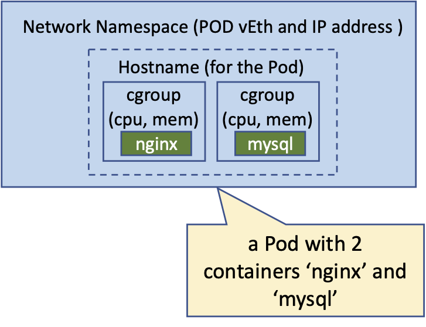
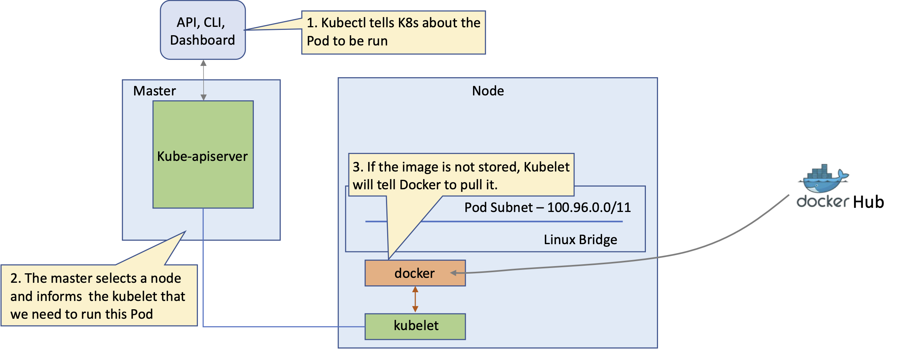

# Understanding Pods

Kubernetes does not deploy containers directly on the worker nodes. The containers are encapsulated into a Kubernetes object
known as Pods. A Pod is a single instance of an application and the smallest object you can create with Kubernetes. Pods have one-to-many relationship with the container(s) supporting the application, to scale up you deploy new Pods and to scale down you delete some Pods. A single Pod can have multiple containers in general not of the same kind. In general, the additional containers running in the same Pod as the App container are responsible to offload part of the processing from it like accessing files or remote database. They can be also used to initialize the environment prior to the deployment of the containers running the application part. We will see later the related design patterns: sidecar and init-containers. Containers in the same Pod share the same network namespace and can communicate to each other via localhost.



In addition to just running a container, a Pod can consume other services like a persistent storage, configuration data, and much more. Therefore, think of a Pod as a wrapper for running containers including the mediator functionality with other Kubernetes objects.

## Containerization Process

Kubernetes is a container orchestrator that uses a container runtime to instantiate containers inside of Pods.

A container packages an application into a single unit of software including its runtime environment and configuration. This unit of software usually includes the operating system, the application’s source code or the binary, its dependencies and other system tools deemed necessary.

The process of bundling an application into a container is commonly referred to as containerization. Containerization works based on instructions defined in a so-called Dockerfile.

The Dockerfile is a blueprint of how the software should be built, the image is the artifact produced by the process, and the container is an running instance of the image serving the application. 

### Run micro-service locally

In the following sections we create a minimal Node.js application which implements a Web server logic including listening to a port and handling `GET` requests and responses with a string message. In Node.js, the web server’s functionality is embedded in the code of the application. A Node.js web application runs as a standalone process.

#### Task 1. Create helloworld.js script

Run the following commands:

```bash
cd
mkdir helloworld
cd helloworld
```

```bash
tee helloworld.js <<"EOF"
const http = require('http');

const port = process.argv[2]
const message = "Hello World\n";

const server = http.createServer((req, res) => {
  res.statusCode = 200;
  res.setHeader('Content-Type', 'text/plain');
  res.end(`${message}`);
});

server.listen(port, () => {
  console.log(`Server running at http://0.0.0.0:${port}/`);
});
EOF
```

#### Task 2. Build Node.js application

Node.js applications are written in JavaScript, which means that there is no explicit compilation step. Instead, they use just-in-time compilation. To build a Node.js application, then means to install its dependencies. Install the dependencies of the ratings service in the same folder:

```bash
sudo apt install -y npm
```

```bash
cd $HOME/helloworld
tee package.json <<EOF
{
  "scripts": {
    "start": "node helloworld.js"
  },
  "dependencies": {}
}
EOF
npm install
```

#### Task 3. Run Node.js application locally

You can run the npm start command with port argument to run the application on the desired port:

```bash
export port=3001
npm start $port &
```

Check the application is working by triggering a `GET` request to the Web server

```bash
curl http://127.0.0.1:$port
```

```console
eti-lab> curl http://127.0.0.1:$port
Hello World
```

Terminate the application:

```bash
kill -9 $(lsof -i :$port | awk 'NR==2 {print $2}')
```

### Run micro-service in Docker

This module shows how you create a Docker image and run it locally. We first have to write a Dockerfile. The Dockerfile can reside in any directory and is essentially a plain-text file. The instructions below use the Node distribution of Node.js 20 as the base image. A base image contains the operating system and the necessary tooling, in this case Node.js. Moreover, we copy the include the package.json and helloworld.js script into /opt/microservices/ of the image.
Finally, we define the npm command that executes the program and expose the port 3000 by default to make the application accessible when run in a container.

#### Task 4. Create Dockerfile

```bash
tee Dockerfile <<EOF
FROM node:20-slim

COPY package.json /opt/microservices/
COPY helloworld.js /opt/microservices/
WORKDIR /opt/microservices

RUN npm install
RUN apt-get update \
    && rm -rf /var/lib/apt/lists/*

ENTRYPOINT ["npm", "start"]
CMD ["3000"]
EOF
```

```console
eti-lab> cat Dockerfile
FROM node:20-slim

COPY package.json /opt/microservices/
COPY helloworld.js /opt/microservices/
WORKDIR /opt/microservices

RUN npm install
RUN apt-get update && rm -rf /var/lib/apt/lists/*

ENTRYPOINT ["npm", "start"]
CMD ["3000"]
```

#### Task 5. Build Docker image

Build the Docker image by running the following command

```bash
cd $HOME/helloworld
docker build -t ubuntu/helloworld .
```

You should have an output similar to:

```console
eti-lab> cd $HOME/helloworld
docker build -t ubuntu/helloworld .
Sending build context to Docker daemon  6.144kB
Step 1/8 : FROM node:20-slim
 ---> 182b4be14c81
Step 2/8 : COPY package.json /opt/microservices/
 ---> d7573a9ea083
Step 3/8 : COPY helloworld.js /opt/microservices/
 ---> a9847319a0da
Step 4/8 : WORKDIR /opt/microservices
 ---> Running in 4035b55f17d6
Removing intermediate container 4035b55f17d6
 ---> df69e0c7b64a
Step 5/8 : RUN npm install
 ---> Running in 4471c91b5158
npm notice created a lockfile as package-lock.json. You should commit this file.
npm WARN microservices No description
npm WARN microservices No repository field.
npm WARN microservices No license field.

up to date in 0.156s
found 0 vulnerabilities

Removing intermediate container 4471c91b5158
 ---> 1645f3f7a1e2
Step 6/8 : RUN apt-get update     && rm -rf /var/lib/apt/lists/*
 ---> Running in de83f7845310
Ign:1 http://deb.debian.org/debian stretch InRelease
Get:2 http://security.debian.org/debian-security stretch/updates InRelease [59.1 kB]
Get:3 http://deb.debian.org/debian stretch-updates InRelease [93.6 kB]
Get:4 http://deb.debian.org/debian stretch Release [118 kB]
Get:5 http://deb.debian.org/debian stretch Release.gpg [3177 B]
Get:6 http://security.debian.org/debian-security stretch/updates/main amd64 Packages [782 kB]
Get:7 http://deb.debian.org/debian stretch/main amd64 Packages [7080 kB]
Fetched 8135 kB in 1s (7058 kB/s)
Reading package lists...
Removing intermediate container de83f7845310
 ---> 28e71a398b0f
Step 7/8 : ENTRYPOINT ["npm", "start"]
 ---> Running in a8653398c3b7
Removing intermediate container a8653398c3b7
 ---> f063bbb5508b
Step 8/8 : CMD ["3000"]
 ---> Running in df4f41aefb40
Removing intermediate container df4f41aefb40
 ---> b8e9cfd29bf8
Successfully built b8e9cfd29bf8
Successfully tagged ubuntu/hellowold:latest
```

#### Task 6. Run Docker container

The you can run a container named `hello` with the image created

```bash
export port=3001
export exposed_port=3002
docker run -d --rm --name hello -p $exposed_port:$port ubuntu/helloworld $port
```

```console
eti-lab> export port=3001
export exposed_port=3002
docker run -d --rm --name hello -p $exposed_port:$port ubuntu/helloworld $port
a63feda9631fd5c5aa078e4e775c5e066a05c7805f1aa97b435acfab5f977bd3
```

Check the application is working

```bash
curl http://127.0.0.1:$exposed_port
```

```console
eti-lab> curl http://127.0.0.1:$exposed_port
Hello World
```

#### Task 7. Terminate Docker container

Terminate the container:

```bash
docker stop hello
```

```console
eti-lab> docker stop hello
hello
```

## Creating Pods

The sequence to deploy Pod on a K8s cluster is indicated below. 



One can consume kube-apiserver API to trigger Pod deployement, for example by using kubectl command. Then kube-scheduler will select the right node for the deployment and tells the related kubelet to proceed with Pod installation. It implies to pull the container images if not already available on the node.

### Task 8. Add container images to cluster

In our case we are adding the Docker image to the Kind node so no need to pull them from an artifactory registry.

```bash
kind load docker-image ubuntu/helloworld:latest --name demo
```

```console
eti-lab> kind load docker-image ubuntu/helloworld:latest --name demo
Image: "ubuntu/helloworld:latest" with ID "sha256:8ba74a37e9877acef1723c95edd53cf9faec1bdccb8c668ab0ea1116aa7835a4" not yet present on node "demo-control-plane", loading...
Image: "ubuntu/helloworld:latest" with ID "sha256:8ba74a37e9877acef1723c95edd53cf9faec1bdccb8c668ab0ea1116aa7835a4" not yet present on node "demo-worker2", loading...
Image: "ubuntu/helloworld:latest" with ID "sha256:8ba74a37e9877acef1723c95edd53cf9faec1bdccb8c668ab0ea1116aa7835a4" not yet present on node "demo-worker", loading...
```

### Task 9. Run Pod

Let's use kubectl to run the application. In order to define a Pod initial configuration, run the following command:

```bash
kubectl run hello --image=ubuntu/helloworld --image-pull-policy=Never --dry-run=client -o yaml > pod.yaml
cat pod.yaml
```

```yaml
apiVersion: v1
kind: Pod
metadata:
  creationTimestamp: null
  labels:
    run: hello
  name: hello
spec:
  containers:
  - image: ubuntu/helloworld
    imagePullPolicy: Never
    name: hello
    resources: {}
  dnsPolicy: ClusterFirst
  restartPolicy: Always
status: {}
```

Then apply the Pod configuration file to create it

```bash
kubectl create -f pod.yaml
```

```console
eti-lab> kubectl create -f pod.yaml 
pod/hello created
```

## Listing and Describing Pods

### Task 10. List Pods

You can check the Pod is deployed and running with the following command:

```bash
kubectl get pods -n default
```

```console
eti-lab> kubectl get pods -n default
NAME    READY   STATUS    RESTARTS   AGE
hello   1/1     Running   0          2m31s
```

To get more information about node hosting the Pod and its IP address enter the following command:

```bash
kubectl get pod hello -o wide -n default
```

```console
eti-lab> kubectl get pod hello -o wide  -n default
NAME    READY   STATUS    RESTARTS   AGE    IP           NODE          NOMINATED NODE   READINESS GATES
hello   1/1     Running   0          4m7s   10.244.1.8   demo-worker   <none>           <none>
```

In our lab the Pod is deployed on node: `demo-worker` and has IP address: `10.244.1.8`. We can notice that 1 container out of 1 is `ready` as well as the Pod status is `Running`.

### Task 11. Describe Pod

You can describe the Pod configuration, status and event with the following command:

```bash
kubectl describe pod hello -n default
```

```console
eti-lab> kubectl describe pod hello -n default
Name:             hello
Namespace:        default
Priority:         0
Service Account:  default
Node:             demo-worker/172.18.0.3
Start Time:       Mon, 03 Oct 2022 05:51:03 +0000
Labels:           run=hello
Annotations:      <none>
Status:           Running
IP:               10.244.1.8
IPs:
  IP:  10.244.1.8
Containers:
  hello:
    Container ID:   containerd://b1edc271ceb95a8463f9de199e4500ecaa70e53a2a46c93a6773356903e236e2
    Image:          ubuntu/helloworld
    Image ID:       docker.io/library/import-2022-10-02@sha256:25cefff467ec3b0f54fbea15571db6cb50be68a6562b498638f96698b893384b
    Port:           <none>
    Host Port:      <none>
    State:          Running
      Started:      Mon, 03 Oct 2022 05:51:04 +0000
    Ready:          True
    Restart Count:  0
    Environment:    <none>
    Mounts:
      /var/run/secrets/kubernetes.io/serviceaccount from kube-api-access-mm7x9 (ro)
Conditions:
  Type              Status
  Initialized       True 
  Ready             True 
  ContainersReady   True 
  PodScheduled      True 
Volumes:
  kube-api-access-mm7x9:
    Type:                    Projected (a volume that contains injected data from multiple sources)
    TokenExpirationSeconds:  3607
    ConfigMapName:           kube-root-ca.crt
    ConfigMapOptional:       <nil>
    DownwardAPI:             true
QoS Class:                   BestEffort
Node-Selectors:              <none>
Tolerations:                 node.kubernetes.io/not-ready:NoExecute op=Exists for 300s
                             node.kubernetes.io/unreachable:NoExecute op=Exists for 300s
Events:
  Type    Reason     Age   From               Message
  ----    ------     ----  ----               -------
  Normal  Scheduled  10m   default-scheduler  Successfully assigned default/hello to demo-worker
  Normal  Pulled     10m   kubelet            Container image "ubuntu/helloworld" already present on machine
  Normal  Created    10m   kubelet            Created container hello
  Normal  Started    10m   kubelet            Started container hello
```

Sometimes it could be useful to get the Pod configuration and status in YAML format when you are refining your specification file, you can run the following command:

```bash
kubectl get pod hello -n default -o yaml
```

```console
eti-lab> kubectl get pod hello -n default -o yaml
apiVersion: v1
kind: Pod
metadata:
  creationTimestamp: "2022-10-03T05:51:03Z"
  labels:
    run: hello
  name: hello
  namespace: default
  resourceVersion: "359641"
  uid: f412c95c-0413-4eb3-83e9-4b98bb3f5c37
spec:
  containers:
  - image: ubuntu/helloworld
    imagePullPolicy: Never
    name: hello
    resources: {}
    terminationMessagePath: /dev/termination-log
    terminationMessagePolicy: File
    volumeMounts:
    - mountPath: /var/run/secrets/kubernetes.io/serviceaccount
      name: kube-api-access-mm7x9
      readOnly: true
  dnsPolicy: ClusterFirst
  enableServiceLinks: true
  nodeName: demo-worker
  preemptionPolicy: PreemptLowerPriority
  priority: 0
  restartPolicy: Always
  schedulerName: default-scheduler
  securityContext: {}
  serviceAccount: default
  serviceAccountName: default
  terminationGracePeriodSeconds: 30
  tolerations:
  - effect: NoExecute
    key: node.kubernetes.io/not-ready
    operator: Exists
    tolerationSeconds: 300
  - effect: NoExecute
    key: node.kubernetes.io/unreachable
    operator: Exists
    tolerationSeconds: 300
  volumes:
  - name: kube-api-access-mm7x9
    projected:
      defaultMode: 420
      sources:
      - serviceAccountToken:
          expirationSeconds: 3607
          path: token
      - configMap:
          items:
          - key: ca.crt
            path: ca.crt
          name: kube-root-ca.crt
      - downwardAPI:
          items:
          - fieldRef:
              apiVersion: v1
              fieldPath: metadata.namespace
            path: namespace
status:
  conditions:
  - lastProbeTime: null
    lastTransitionTime: "2022-10-03T05:51:03Z"
    status: "True"
    type: Initialized
  - lastProbeTime: null
    lastTransitionTime: "2022-10-03T05:51:04Z"
    status: "True"
    type: Ready
  - lastProbeTime: null
    lastTransitionTime: "2022-10-03T05:51:04Z"
    status: "True"
    type: ContainersReady
  - lastProbeTime: null
    lastTransitionTime: "2022-10-03T05:51:03Z"
    status: "True"
    type: PodScheduled
  containerStatuses:
  - containerID: containerd://b1edc271ceb95a8463f9de199e4500ecaa70e53a2a46c93a6773356903e236e2
    image: docker.io/ubuntu/helloworld:latest
    imageID: docker.io/library/import-2022-10-02@sha256:25cefff467ec3b0f54fbea15571db6cb50be68a6562b498638f96698b893384b
    lastState: {}
    name: hello
    ready: true
    restartCount: 0
    started: true
    state:
      running:
        startedAt: "2022-10-03T05:51:04Z"
  hostIP: 172.18.0.3
  phase: Running
  podIP: 10.244.1.8
  podIPs:
  - ip: 10.244.1.8
  qosClass: BestEffort
  startTime: "2022-10-03T05:51:03Z"
```

## Accessing Pods logs

### Task 12. Get Pod logs

You can get the logs from the Pod using the following kubectl command:

```bash
kubectl logs hello -n default
```

```console
eti-lab> kubectl logs hello -n default

> @ start /opt/microservices
> node helloworld.js "3000"

Server running at http://0.0.0.0:3000/
```

## Running command in Container

### Task 13. Run Pod Busybox

```bash
kubectl run bb --image=busybox -- sleep 36000
```

```console
eti-lab> kubectl run bb --image=busybox -- sleep 36000
pod/bb created
```

### Task 14. Exec command on Pod

We want to perform a http `GET` request from the Busybox to test our helloworld application. Let's first retrieve the IP address of the Pod hello:

```bash
export helloip="$(kubectl get pod hello -o go-template='{{(.status.podIP)}}')"
echo $helloip
```

In our lab the output is:

```console
10.244.1.8
```

Then execute the test command on Pod bb:

```bash
kubectl exec bb -- wget -O -  http://$helloip:3000
```

```console
eti-lab> kubectl exec bb -- wget -O -  http://$helloip:3000
Hello World
Connecting to 10.244.1.8:3000 (10.244.1.8:3000)
writing to stdout
-                    100% |********************************|    12  0:00:00 ETA
written to stdout
```

## Configuring Pod

So far we have relied on default parameter from the Docker image where ENTRYPOINT and CMD are respectively defined as [npm star] and ["3000"]. It is possible to override these value in the Pod configuration file. It can be done in different way like direct key/value, configmap, secret... For now we use direct key/value.

### Task 15. Override Docker commands

Create the `podkv.yaml` Pod configuration file with the following command:

```bash
tee podkv.yaml <<EOF 
apiVersion: v1
kind: Pod
metadata:
  creationTimestamp: null
  labels:
    run: hello
  name: hello
spec:
  containers:
  - image: ubuntu/helloworld
    imagePullPolicy: Never
    name: hello
    resources: {}
    command: 
      - npm
      - start
    args:
      - "3001"
  dnsPolicy: ClusterFirst
  restartPolicy: Always
status: {}
EOF
```

Notice that we are keeping the [npm start] as Docker `ENTRYPOINT` specified in Pod definition `command` under spec/containers, and we are overriding the port `3000` in Docker `CMD` with port `3001` in Pod definition `args`.

### Task 16. Create Pod with new args

Run the following command to create the Pod hello with the new port configured to `3001`:

```bash
kubectl delete -f podkv.yaml
kubectl apply -f podkv.yaml
```

```console
eti-lab> kubectl apply -f podkv.yaml
pod/hello created
```

Check the Pod is running:

```bash
kubectl get pods
```

```console
eti-lab> kubectl get pods
NAME    READY   STATUS    RESTARTS   AGE
bb      1/1     Running   0          35m
hello   1/1     Running   0          7s
```

### Task 17. Check args are used

First get the IP address of the new Pod hello:

```bash
export helloip="$(kubectl get pod hello -o go-template='{{(.status.podIP)}}')"
echo $helloip
```

```console
eti-lab> export helloip="$(kubectl get pod hello -o go-template='{{(.status.podIP)}}')"
echo $helloip
10.244.1.9
```

Test the helloworld application on the former port `3000`:

```bash
kubectl exec bb -- wget -O -  http://$helloip:3000
```

```console
eti-lab> kubectl exec bb -- wget -O -  http://$helloip:3000
Connecting to 10.244.1.9:3000 (10.244.1.9:3000)
wget: can't connect to remote host (10.244.1.9): Connection refused
command terminated with exit code 1
```

You can notice that is doesn't work anymore.

Check then with the new port `3001`:

```bash
kubectl exec bb -- wget -O -  http://$helloip:3001
```

We can see that it works, meaning the port configuration has been overwritten:

```console
eti-lab> kubectl exec bb -- wget -O -  http://$helloip:3001
Connecting to 10.244.1.9:3001 (10.244.1.9:3001)
writing to stdout
-                    100% |********************************|    12  0:00:00 ETA
written to stdout
Hello World
```

## Deleting Pod

### Task 18. Delete all the Pods

```bash
export podlist="$(kubectl get pods -o go-template='{{range .items}}{{.metadata.name}}{{" , "}}{{end}}')"
echo $podlist
```

```bash
kubectl delete pods $podlist
```

```console
eti-lab> kubectl delete pod $podlist
pod "bb" deleted
pod "hello" deleted
Error from server (NotFound): pods "," not found
```

``` bash
kubectl get pods
```

```console
eti-lab> kubectl get pods
No resources found in default namespace.
```
