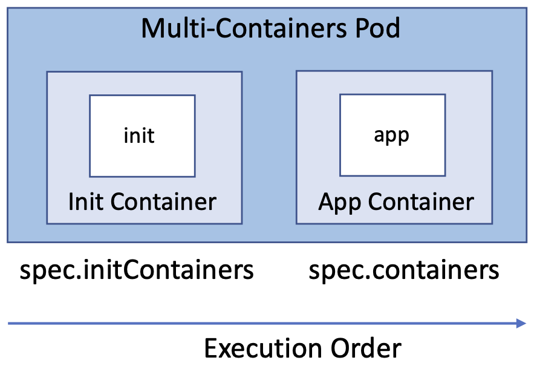
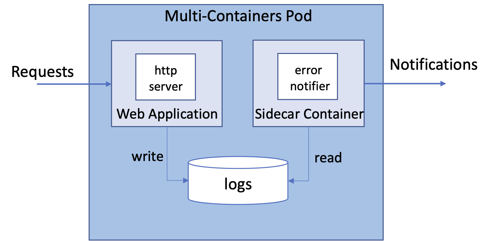
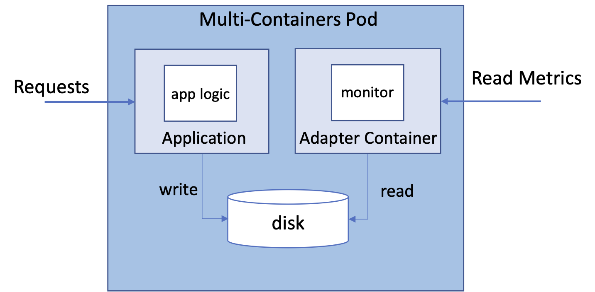
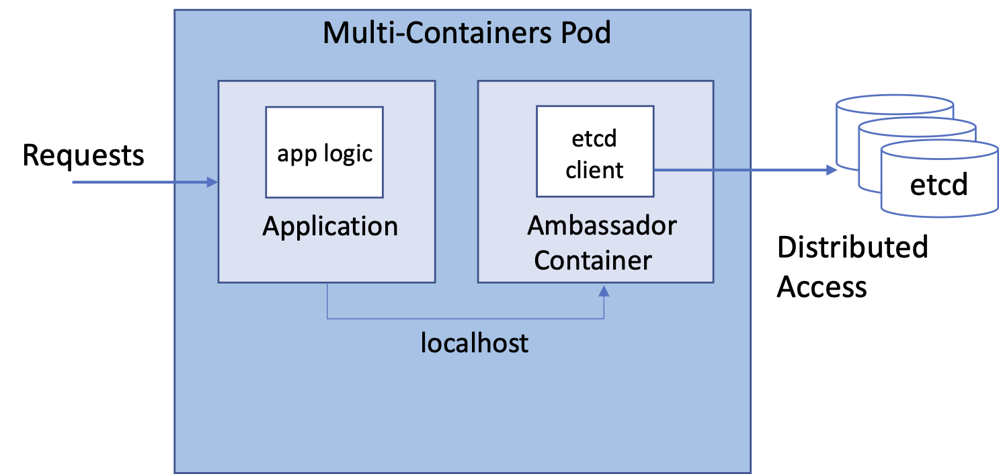

# Multi-containers Pods

Technically, a Pod allows you to configure and run multiple containers. But the best practice is to run a single microservice inside of Pod to reinforce separation of concerns and increased cohesion. This modus operandi promotes a decentralized, decoupled, and distributed architecture. Furthermore, it helps with rolling out new versions of a microservice without necessarily interrupting other parts of the system.

So why we care about multi-containers Pods ?

There are two common use cases. Sometimes, you’ll want to initialize your Pod by executing setup scripts, commands, or any other kind of preconfiguration procedure before the application container should start. This logic runs in a so-called init container.
Other times, you’ll want to provide helper functionality that runs alongside the application container to avoid the need to bake the logic into application code. For example, you may want to massage the log output produced by the application. Containers running helper logic are called sidecars.

## Init Containers

Init containers provide initialization logic concerns to be run before the main application even starts. In Kubernetes, this functionality can be achieved with the help of init containers. Init containers are always started before the main application containers, which means they have their own lifecycle. To split up the initialization logic, you can even distribute the work into multiple init containers that are run in the order of definition in the manifest. Of course, initialization logic can fail. If an init container produces an error, the whole Pod is restarted, causing all init containers to run again in sequential order. Thus, to prevent any side effects, making init container logic idempotent is a good practice.



### Task 1. Check Pod without initialization

Deploy a Pod with nginx container and check the homepage returned. Execute the following to create the Pod:

```bash
kubectl delete pod nx
kubectl create -f - <<"EOF"
apiVersion: v1
kind: Pod
metadata:
  name: nx
spec:
  containers:
  - name: nginx
    image: nginx
    ports:
    - containerPort: 80
  dnsPolicy: Default
EOF
```

Check the homepage returned is the default one used by Nginx with title `Welcome to nginx!`:

```bash
kubectl exec nx -it -c nginx -- curl localhost
```

```console
eti-lab> kubectl exec nx -it -c nginx -- curl localhost
<!DOCTYPE html>
<html>
<head>
<title>Welcome to nginx!</title>
<style>
html { color-scheme: light dark; }
body { width: 35em; margin: 0 auto;
font-family: Tahoma, Verdana, Arial, sans-serif; }
</style>
</head>
<body>
<h1>Welcome to nginx!</h1>
<p>If you see this page, the nginx web server is successfully installed and
working. Further configuration is required.</p>

<p>For online documentation and support please refer to
<a href="http://nginx.org/">nginx.org</a>.<br/>
Commercial support is available at
<a href="http://nginx.com/">nginx.com</a>.</p>

<p><em>Thank you for using nginx.</em></p>
</body>
</html>
```

### Task 2. Create Pod with init container

Now we want to change the homepage with a different one, say `http://info.cern.ch`. We can either modify the nginx image or use an init container to initialize the nginx configuration for us. Following the init container design pattern, we add an init container to `spec.initicontainers` which copy the `http://info.cern.ch` html code under a volume `static-html` which is also mounted by the nginx container as `/usr/share/nginx/html` path:

```bash
kubectl delete pod nx
kubectl create -f - <<"EOF"
apiVersion: v1
kind: Pod
metadata:
  name: nx
spec:
  containers:
  - name: nginx
    image: nginx
    ports:
    - containerPort: 80
    volumeMounts:
    - name: static-html
      mountPath: /usr/share/nginx/html
  # These containers are run during pod initialization
  initContainers:
  - name: init-index
    image: busybox:1.28
    command:
    - wget
    - "-O"
    - "/static-html/index.html"
    - http://info.cern.ch
    volumeMounts:
    - name: static-html
      mountPath: "/static-html"
  dnsPolicy: Default
  volumes:
  - name: static-html
    emptyDir: {}
EOF
```

Check the default page server by our nx application is now the one from Cern:

```bash
kubectl exec nx -it -c nginx -- curl localhost
```

```console
eti-lab> kubectl exec nx -it -c nginx -- curl localhost
<html><head></head><body><header>
<title>http://info.cern.ch</title>
</header>

<h1>http://info.cern.ch - home of the first website</h1>
<p>From here you can:</p>
<ul>
<li><a href="http://info.cern.ch/hypertext/WWW/TheProject.html">Browse the first website</a></li>
<li><a href="http://line-mode.cern.ch/www/hypertext/WWW/TheProject.html">Browse the first website using the line-mode browser simulator</a></li>
<li><a href="http://home.web.cern.ch/topics/birth-web">Learn about the birth of the web</a></li>
<li><a href="http://home.web.cern.ch/about">Learn about CERN, the physics laboratory where the web was born</a></li>
</ul>
</body></html>
```

You can check the logs of the init container by refering it to the kubectl logs command:

```bash
kubectl logs nx -c init-index
```

```console
eti-lab> kubectl logs nx -c init-index
Connecting to info.cern.ch (188.184.21.108:80)
index.html           100% |*******************************|   646   0:00:00 ETA
```

## The Sidecar Pattern

Typically, there are two different categories of containers: the container that runs the application and another container that provides helper functionality to the primary application. In the Kubernetes space, the container providing helper functionality is called a sidecar. Among the most commonly used capabilities of a sidecar container are file synchronization, logging, and watcher capabilities.



### Task 3. Create Pod with sidecar

Deploy a Pod with nginx container and sidecar container. The command on sidecar container runs an infinite loop. As part of each iteration, we inspect the contents of the file error.log, grep for an error and potentially act on it. The loop executes every 10 seconds:

```bash
kubectl delete pod nx
kubectl create -f - <<"EOF"
apiVersion: v1
kind: Pod
metadata:
  name: nx
spec:
  containers:
  - name: nginx
    image: nginx
    volumeMounts:
    - name: logs-vol
      mountPath: /var/log/nginx
  - name: sidecar
    image: busybox
    command: ["sh","-c","while true; do if [ \"$(cat /var/log/nginx/error.log \
              | grep 'error')\" != \"\" ]; then echo 'Error discovered!'; fi; \
              sleep 10; done"]
    volumeMounts:
    - name: logs-vol
      mountPath: /var/log/nginx
  volumes:
  - name: logs-vol
    emptyDir: {}
EOF
```

Check the status of the Pod:

```bash
kubectl get pod nx
```

When starting up the Pod, you’ll notice that the overall number of containers will show 2. After all containers can be started, the Pod signals a Running status:

```console
eti-lab> kubectl get pod nx
NAME   READY   STATUS    RESTARTS   AGE
nx     2/2     Running   0          2m25s
```

Check that `error.log` does not contain any failure to begin with:

```bash
kubectl exec nx -c nginx -- cat /var/log/nginx/error.log
```

```console
eti-lab> kubectl exec nx -c nginx -- cat /var/log/nginx/error.log
eti-lab> kubectl exec nx -c nginx -- cat /var/log/nginx/error.log
2022/10/07 09:44:02 [notice] 1#1: using the "epoll" event method
2022/10/07 09:44:02 [notice] 1#1: nginx/1.23.1
2022/10/07 09:44:02 [notice] 1#1: built by gcc 10.2.1 20210110 (Debian 10.2.1-6) 
2022/10/07 09:44:02 [notice] 1#1: OS: Linux 5.15.0-1019-aws
2022/10/07 09:44:02 [notice] 1#1: getrlimit(RLIMIT_NOFILE): 1048576:1048576
2022/10/07 09:44:02 [notice] 1#1: start worker processes
2022/10/07 09:44:02 [notice] 1#1: start worker process 37
2022/10/07 09:44:02 [notice] 1#1: start worker process 38
...
```

### Task 4. Manage logs with sidecar

With the following commands, you’ll provoke an error on purpose:

```bash
kubectl exec nx -it -c sidecar -- wget -O- localhost?unknown
```

```console
eti-lab> kubectl exec nx -it -c sidecar -- wget -O- localhost?unknown
Connecting to localhost (127.0.0.1:80)
wget: server returned error: HTTP/1.1 404 Not Found
command terminated with exit code 1
```

After waiting for at least 10 seconds, you’ll find the expected message on the terminal, which you can query for with the logs command:

```bash
kubectl logs nx -c sidecar
```

``` console
eti-lab> kubectl logs nx -c sidecar
Error discovered!
```

## The Adapter Pattern

The adapter pattern transforms the output produced by the application to make it consumable in the format needed by another part of the system. It takes heterogeneous containerized system and makes it conform to a consistent, unified interface with a standardized and normalized format that can be consumed by the outside world. The Adapter is a specialization of the Sidecar pattern.



## The Ambassador Pattern

The ambassador pattern provides a proxy for communicating with external services. The overarching goal is to hide and/or abstract the complexity of interacting with other parts of the system. Typical responsibilities include retry logic upon a request failure, security concerns like providing authentication or authorization, or monitoring latency or resource usage.

