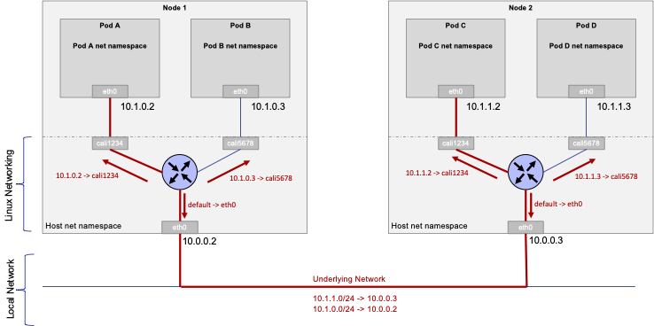

# Pod Networking

Kubernetes approach to networking relies on some basic principles:

- Any Pod can communicate with any other Pod without the use of network address translation (NAT). To facilitate this, Kubernetes assigns each Pod an IP address that is routable within the cluster.
- A node can communicate with a Pod without the use of NAT.
- A Pod's awareness of its address is the same as how other resources see the address. The host's address doesn't mask it.

These principles give a unique and first-class identity to every Pod in the cluster. Because of this, the networking model is straightforward and does not need to include port mapping for the running container workloads.

The figure below highlights the Kubernetes Pod networking principles:



In our lab, Calico Container Network Interface (CNI) plugin is responsible for the Pod interface management and route programming.

## Task 1. Deploy Pods

We will deploy 2 Pods (named bb1 and bb2) running the `busybox` image. Busybox image includes tools to check IP connectivity like wget, nc, ping, traceroute... We want also to deploy the Pods on different nodes to test the inter-node communication, therefore bb1 and bb2 are deployed on demo-worker and demo-worker2 respectively.

Run the following command to label the nodes:

```bash
kubectl label node demo-worker alias=firstWorker --overwrite
kubectl label node demo-worker2 alias=secondWorker --overwrite
```

Run the following command to deploy bb1 and bb2 Pods running both the `busybox` image on demo-worker and demo-worker2 respectively:

```bash
kubectl run bb1 --image=busybox --overrides='{"spec": { "nodeSelector": {"alias": "firstWorker"}}}' --dry-run=client -o yaml -- sleep 3600 > bb1.yaml
kubectl run bb2 --image=busybox --overrides='{"spec": { "nodeSelector": {"alias": "secondWorker"}}}' --dry-run=client -o yaml -- sleep 3600 > bb2.yaml
kubectl apply -f bb1.yaml
kubectl apply -f bb2.yaml
```

## Task 2. Check Nodes selection

Run the following command to understand where the 2 Pods are respectively deployed:

```bash
kubectl get pods bb1 bb2 -n default -o wide
```

The output should be similar to:

```console
eti-lab>    kubectl get pods bb1 bb2 -n default -o wide
NAME   READY   STATUS    RESTARTS   AGE   IP                NODE           NOMINATED NODE   READINESS GATES
bb1    1/1     Running   0          48s   192.168.157.134   demo-worker    <none>           <none>
bb2    1/1     Running   0          46s   192.168.121.73    demo-worker2   <none>           <none>
```

## Task 2. Get Pods IP addresses

Run the following commands to get the IP address for each Pod:

```bash
export bb1_ip=$(kubectl get pod bb1 -o go-template --template '{{.status.podIP}}')
echo $bb1_ip
export bb2_ip=$(kubectl get pod bb2 -o go-template --template '{{.status.podIP}}')
echo $bb2_ip
```

The output should be similar to:

```console
eti-lab> export bb1_ip=$(kubectl get pod bb1 -o go-template --template '{{.status.podIP}}')
eti-lab> echo $bb1_ip
192.168.157.134
eti-lab> export bb2_ip=$(kubectl get pod bb2 -o go-template --template '{{.status.podIP}}')
eti-lab> echo $bb2_ip
192.168.121.73
```

## Task 3. Understand Nodes IP routes

Run the following commands to understand the routes installed in demo-worker node:

```bash
docker exec -it demo-worker ip route
```

The output should be similar to:

```console
eti-lab> docker exec -it demo-worker ip route
default via 172.18.0.1 dev eth0 
172.18.0.0/16 dev eth0 proto kernel scope link src 172.18.0.4 
192.168.121.64/26 via 172.18.0.2 dev eth0 proto 80 onlink 
blackhole 192.168.157.128/26 proto 80 
192.168.157.129 dev cali0cf1c4ecf1f scope link 
192.168.157.130 dev cali8613303cd04 scope link 
192.168.157.134 dev cali98fd8882b62 scope link 
192.168.210.0/26 via 172.18.0.3 dev eth0 proto 80 onlink
```

In our case we can notice that Calico CNI has created an interface `cali98fd8882b62` for Pod bb1 from entry `192.168.157.134 dev cali98fd8882b62 scope link`.

We can also identify the IP addresses block `192.168.157.128/26` allocated by Calico CNI for demo-worker from entry `blackhole 192.168.157.128/26 proto 80`

Finally we can observe the routes to the other Pods subnet on the other nodes like `192.168.210.0/26 via 172.18.0.3` and `192.168.121.64/26 via 172.18.0.2`

## Task 4. Check IP connectivity

Run the following command to check bb1 Pod has connectivity towards the Internet:

```bash
kubectl exec bb1 -- ping -c 5 8.8.8.8
```

You should have a similar output to:

```console
eti-lab> kubectl exec bb1 -- ping -c 5 8.8.8.8
PING 8.8.8.8 (8.8.8.8): 56 data bytes
64 bytes from 8.8.8.8: seq=0 ttl=42 time=7.829 ms
64 bytes from 8.8.8.8: seq=1 ttl=42 time=7.824 ms
64 bytes from 8.8.8.8: seq=2 ttl=42 time=7.741 ms
64 bytes from 8.8.8.8: seq=3 ttl=42 time=7.715 ms
64 bytes from 8.8.8.8: seq=4 ttl=42 time=7.755 ms

--- 8.8.8.8 ping statistics ---
5 packets transmitted, 5 packets received, 0% packet loss
round-trip min/avg/max = 7.715/7.772/7.829 ms
```

As well as towards bb2 Pod:

```bash
kubectl exec bb1 -- ping -c 5 $bb2_ip
```

You should have a similar output to:

```console
eti-lab> kubectl exec bb1 -- ping -c 5 $bb2_ip
PING 192.168.121.73 (192.168.121.73): 56 data bytes
64 bytes from 192.168.121.73: seq=0 ttl=62 time=0.141 ms
64 bytes from 192.168.121.73: seq=1 ttl=62 time=0.111 ms
64 bytes from 192.168.121.73: seq=2 ttl=62 time=0.092 ms
64 bytes from 192.168.121.73: seq=3 ttl=62 time=0.102 ms
64 bytes from 192.168.121.73: seq=4 ttl=62 time=0.121 ms

--- 192.168.121.73 ping statistics ---
5 packets transmitted, 5 packets received, 0% packet loss
round-trip min/avg/max = 0.092/0.113/0.141 ms
```

## Task 5. Understand Traceroute between Pods

Let's trace the path from bb2 to bb1 with the following command

```bash
kubectl exec bb2 -- traceroute $bb1_ip
```

You should have the similar output:

```console
eti-lab> kubectl exec bb2 -- traceroute $bb1_ip
traceroute to 192.168.157.134 (192.168.157.134), 30 hops max, 46 byte packets
 1  172-18-0-2.calico-typha.calico-system.svc.cluster.local (172.18.0.2)  0.006 ms  0.005 ms  0.004 ms
 2  172-18-0-4.calico-typha.calico-system.svc.cluster.local (172.18.0.4)  0.002 ms  0.004 ms  0.003 ms
 3  ip-192-168-157-134.us-west-2.compute.internal (192.168.157.134)  0.003 ms  0.004 ms  0.005 ms
```

We can verify the packets are first handled by Calico service on node demo-worker2, then Calico service on node demo-worker and finally bb1.

## Task 6. Delete Pods

Delete the bb Pod before to move to the next chapter.

```bash
kubectl delete pod bb1 bb2
```

Check you have the similar output:

```console
eti-lab> kubectl delete pod bb1 bb2
pod "bb1" deleted
pod "bb2" deleted
```