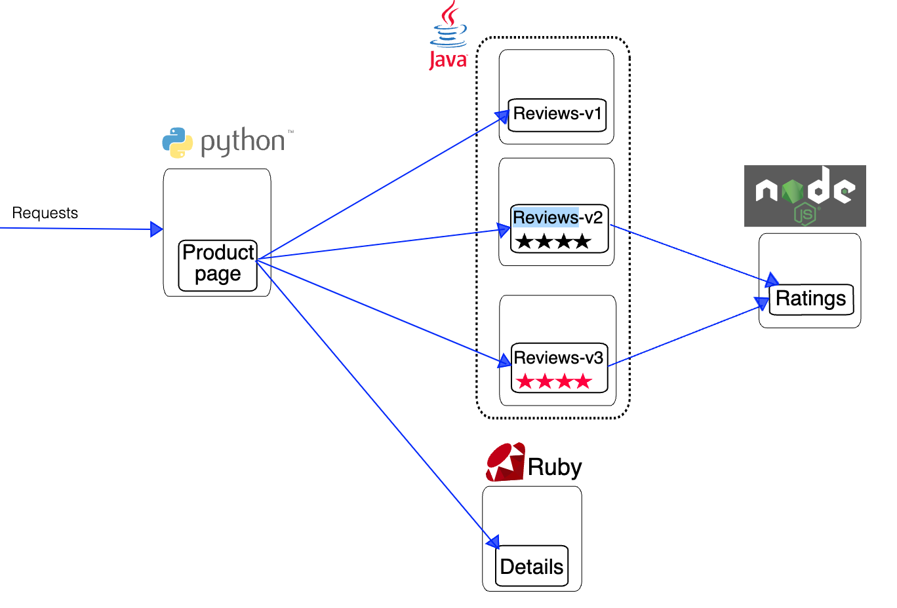

# Istio Service Mesh

Istio extends Kubernetes to establish a programmable, application-aware network using the powerful Envoy service proxy. Working with both Kubernetes and traditional workloads, Istio brings standard, universal traffic management, telemetry, and security to complex deployments.


Istio brings the following functionalities:

- Traffic Management: Routing traffic, both within a single cluster and across clusters, affects performance and enables better deployment strategy. Istio’s traffic routing rules let you easily control the flow of traffic and API calls between services. Istio simplifies configuration of service-level properties like circuit breakers, timeouts, and retries, and makes it easy to set up important tasks like A/B testing, canary deployments, and staged rollouts with percentage-based traffic splits.

- Observability: As services grow in complexity, it becomes challenging to understand behavior and performance. Istio generates detailed telemetry for all communications within a service mesh. This telemetry provides observability of service behavior, empowering operators to troubleshoot, maintain, and optimize their applications. Even better, you get almost all of this instrumentation without requiring application changes.
Istio’s telemetry includes detailed metrics, distributed traces, and full access logs.

- Security: Microservices have particular security needs, including protection against man-in-the-middle attacks, flexible access controls, auditing tools, and mutual TLS. Istio includes a comprehensive security solution to give operators the ability to address all of these issues. It provides strong identity, powerful policy, transparent TLS encryption, and authentication, authorization and audit (AAA) tools to protect your services and data.

## Task 1. Download Istio

Download Istio 1.16.0 for the x86_64 architecture, run:

```bash
curl -L https://istio.io/downloadIstio | ISTIO_VERSION=1.16.0 TARGET_ARCH=x86_64 sh -
```

You should have a similar output

```console
eti-lab> curl -L https://istio.io/downloadIstio | ISTIO_VERSION=1.16.0 TARGET_ARCH=x86_64 sh -  

% Total    % Received % Xferd  Average Speed   Time    Time     Time  Current
                                 Dload  Upload   Total   Spent    Left  Speed
100   101  100   101    0     0    483      0 --:--:-- --:--:-- --:--:--   483
100  4856  100  4856    0     0  14987      0 --:--:-- --:--:-- --:--:-- 14987

Downloading istio-1.16.0 from https://github.com/istio/istio/releases/download/1.16.0/istio-1.16.0-linux-amd64.tar.gz ...

Istio 1.16.0 Download Complete!

Istio has been successfully downloaded into the istio-1.16.0 folder on your system.

Next Steps:
See https://istio.io/latest/docs/setup/install/ to add Istio to your Kubernetes cluster.

To configure the istioctl client tool for your workstation,
add the /home/ubuntu/istio-1.16.0/bin directory to your environment path variable with:
         export PATH="$PATH:/home/ubuntu/istio-1.16.0/bin"

Begin the Istio pre-installation check by running:
         istioctl x precheck 

Need more information? Visit https://istio.io/latest/docs/setup/install/ 
```

## Task 2. Install Istio

For this installation, we use the demo configuration profile. It’s selected to have a good set of defaults for testing, but there are other profiles for production or performance testing.

Move to the Istio package directory, add the istioctl client to your path and install istio with a `demo` profile:

```bash
cd istio-1.16.0
export PATH=$PWD/bin:$PATH
istioctl install --set profile=demo -y
```

```console
eti-lab> istioctl install --set profile=demo -y
✔ Istio core installed                
✔ Istiod installed    
✔ Egress gateways installed             
✔ Ingress gateways installed                                                                                                          
✔ Installation complete
Making this installation the default for injection and validation.

Thank you for installing Istio 1.16.  Please take a few minutes to tell us about your install/upgrade experience!  
https://forms.gle/99uiMML96AmsXY5d6
```

## Task 3. Label default namespace for Istio injection

Add a namespace label to instruct Istio to automatically inject Envoy sidecar proxies when you deploy your application later:

```bash
kubectl label namespace default istio-injection=enabled
```

You should have a similar output:

```console
eti-lab> kubectl label namespace default istio-injection=enabled
namespace/default labeled
```

## Task 4. Deploy the sample bookinfo application

The Book Info application architecture is represented on that diagram:



Run the following command to deploy Bookinfo application on your Kubernetes cluster:

```bash
kubectl apply -f samples/bookinfo/platform/kube/bookinfo.yaml
```

You should have a similar output:

```console
eti-lab> kubectl apply -f samples/bookinfo/platform/kube/bookinfo.yaml
service/details created
serviceaccount/bookinfo-details created
deployment.apps/details-v1 created
service/ratings created
serviceaccount/bookinfo-ratings created
deployment.apps/ratings-v1 created
service/reviews created
serviceaccount/bookinfo-reviews created
deployment.apps/reviews-v1 created
deployment.apps/reviews-v2 created
deployment.apps/reviews-v3 created
service/productpage created
serviceaccount/bookinfo-productpage created
deployment.apps/productpage-v1 created
```

The application will start. As each pod becomes ready, the Istio sidecar will be deployed along with it.

## Task 5. Check the bookinfo application status

Run the following command to check the Pods status:

```bash
kubectl get pods
```

```console
eti-lab> kubectl get pods
NAME                             READY   STATUS    RESTARTS   AGE
details-v1-698b5d8c98-rjchh      2/2     Running   0          73s
productpage-v1-bf4b489d8-sm4z2   2/2     Running   0          72s
ratings-v1-5967f59c58-4vgpc      2/2     Running   0          73s
reviews-v1-9c6bb6658-2tbrv       2/2     Running   0          73s
reviews-v2-8454bb78d8-csknv      2/2     Running   0          72s
reviews-v3-6dc9897554-bwkjl      2/2     Running   0          72s
```

 Wait until all pods report READY 2/2 and STATUS Running before you go to the next step. This might take a few minutes depending on your platform.

Verify everything is working correctly up to this point. Run this command to see if the app is running inside the cluster and serving HTML pages by checking for the page title in the response:

```bash
kubectl exec "$(kubectl get pod -l app=ratings -o jsonpath='{.items[0].metadata.name}')" -c ratings -- curl -sS productpage:9080/productpage | grep -o "<title>.*</title>"
```

You should have a similar output:

```console
eti-lab> kubectl exec "$(kubectl get pod -l app=ratings -o jsonpath='{.items[0].metadata.name}')" -c ratings -- curl -sS productpage:9080/productpage | grep -o "<title>.*</title>"
<title>Simple Bookstore App</title>
```

## Task 6. Configure the Service Mesh Gateway and Virtual Service

The Bookinfo application is deployed but not accessible from the outside. To make it accessible, you need to create an Istio Ingress Gateway, which maps a path to a route at the edge of your mesh.

You use a gateway to manage inbound and outbound traffic for your mesh, letting you specify which traffic you want to enter or leave the mesh. Gateway configurations are applied to standalone Envoy proxies that are running at the edge of the mesh, rather than sidecar Envoy proxies running alongside your service workloads.

Run the following command to define the Istio Mesh Gateway and Virtual Service configurations:

```bash
cat > bookinfo-gw-vs.yaml << EOF
apiVersion: networking.istio.io/v1alpha3
kind: Gateway
metadata:
  name: bookinfo-gateway
spec:
  selector:
    istio: ingressgateway # use istio default controller
  servers:
  - port:
      number: 80
      name: http
      protocol: HTTP
    hosts:
    - "*"
---
apiVersion: networking.istio.io/v1alpha3
kind: VirtualService
metadata:
  name: bookinfo
spec:
  hosts:
  - "*"
  gateways:
  - bookinfo-gateway
  http:
  - match:
    - uri:
        exact: /productpage
    - uri:
        prefix: /static
    - uri:
        exact: /login
    - uri:
        exact: /logout
    - uri:
        prefix: /api/v1/products
    route:
    - destination:
        host: productpage
        port:
          number: 9080
EOF
```

Then apply the configuration:

```bash
kubectl apply -f bookinfo-gw-vs.yaml
```

You should have a similar output:

```console
eti-lab> kubectl apply -f bookinfo-gw-vs.yaml
gateway.networking.istio.io/bookinfo-gateway created
virtualservice.networking.istio.io/bookinfo created
```

## Task 7. Configuration sanity check

Ensure that there are no issues with the configuration by running:

```bash
istioctl analyze
```

You should have the following output:

```console
eti-lab> istioctl analyze

✔ No validation issues found when analyzing namespace: default.
```

## Task 8. Expose Bookinfo to outside

Follow these instructions to set the `ingressip` variable for accessing the gateway.

```bash
ingressip=$(kubectl get svc istio-ingressgateway -n istio-system -o jsonpath="{.status.loadBalancer.ingress[0].ip}")
echo $ingressip
```

Finally expose the gateway to the external world by adding a reverse proxy on the host:

```bash
caddy reverse-proxy --from :8080 --to ${ingressip}:80 > /dev/null 2>&1 &
```

## Task 9. Access Bookinfo from outside

With the reverse proxy and Istio Ingress Gateway configured check you can get access to the bookinfo application from your browser [BOOKINFO](http://location.hostname:8080/productpage).


Refresh the page multiple time and notice the change in Book Reviews look and feel with review including alternatively red stars, black stars and no star. It is because three different versions of one of the microservices, reviews, have been deployed and are running concurrently. We will fix that issue with Istio `Request Routing` traffic management capability.

## Task 10. Get visibility on Application topology

Istio integrates with several different telemetry applications. These can help you gain an understanding of the structure of your service mesh, display the topology of the mesh, and analyze the health of your mesh.

Use the following instructions to deploy the Kiali dashboard, along with Prometheus, Grafana, and Jaeger.

```bash
kubectl apply -f samples/addons
kubectl rollout status deployment/kiali -n istio-system
```

Launch the Kiali dashboard

```bash
istioctl dashboard kiali &
caddy reverse-proxy --from :8081 --to :20001 > /dev/null 2>&1 &
```

You can open the Kiali dashboard at the following URL [KIALI](http://location.hostname:8081)

## Task 11. Generate traffic towards Book Info

```bash
ingressip=$(kubectl get svc istio-ingressgateway -n istio-system -o jsonpath="{.status.loadBalancer.ingress[0].ip}")
echo $ingressip
for i in $(seq 1 100); do curl -s -o /dev/null http://${ingressip}:80/productpage; done
```

Check the Kiali dashboard again on the Kiali browser tab. If you closed it use that link [KIALI](http://location.hostname:8081)

You should have an output similar to:


## Task 12. Apply Destination Rule Configuration

Along with virtual services, destination rules are a key part of Istio’s traffic routing functionality. You can think of virtual services as how you route your traffic to a given destination, and then you use destination rules to configure what happens to traffic for that destination. Destination rules are applied after virtual service routing rules are evaluated, so they apply to the traffic’s “real” destination.

Run the following to configure and visualize the Istio Service Mesh destination rules:

```bash
kubectl apply -f samples/bookinfo/networking/destination-rule-all.yaml
kubectl get destinationrules -o yaml
```

## Task 13. Apply Virtual Services Configuration

Run the following to configure and visualize the Istio Service Mesh destination rules:

```bash
kubectl apply -f samples/bookinfo/networking/virtual-service-all-v1.yaml
kubectl get virtualservices -o yaml
```

## Task 14. Check Book Info product page

Check the Product Page is consistent after several page refresh and only the no-star version of the reviews app is used. [BOOKINFO](http://location.hostname:8080/productpage)

You should have always the same page similar to:

