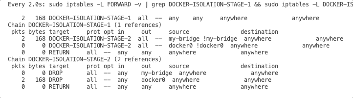

# In depth Single host container networking

The section on Docker networking is designed to provide a comprehensive understanding of container network concepts and Linux core networking capabilities. The objective is to experiment with Docker engine and familiarize oneself with the core container networking challenges. By the end of this section, you will have gained a better understanding of container networking, its challenges, and how to leverage Linux networking capabilities to address them

## Lab Topology and overview

Linux has rich virtual networking capabilities that are used as basis for hosting VMs and containers, as well as cloud environments.
The actual implementation of container networking and security is deeply bond to Linux core networking capabilities.
In the end, the orchestration of containers and their networking aspects is only an assemblage of linux wellknown technologies that allows the host to switch, route, NAT/PAT and firewall.

This lab will be conducted on a single VM using linux os Ubuntu 20.04.

---

## Task 1. Install Docker

Docker is not the only tool to manage containers, for example [Podman](https://podman.io) is a popular alternative.
The key concepts that you will experiment on the following lab focus on container networking and remains relevant across the different container engines.

Install docker with the following commands :

```bash
sudo apt update
sudo apt install -y docker.io
```

You should have an output similar to:

```console
Hit:1 http://us-west-2.ec2.archive.ubuntu.com/ubuntu jammy InRelease
Get:2 http://us-west-2.ec2.archive.ubuntu.com/ubuntu jammy-updates InRelease [114 kB]
...
No VM guests are running outdated hypervisor (qemu) binaries on this host.
```

To be able to use docker without having to type `sudo docker <cmd>` add the current user to docker group, and relog user.
```bash
sudo usermod -aGdocker $USER
sudo su - $USER
```

and restart the web terminal demon to take changes into account for all terminal sessions:

```bash
sudo service ttyd restart
```

## Task 2. List default docker networks

By default Docker creates for you several networks

List default networks 

```bash
docker network list
```

The output is similar to this:

```console
NETWORK ID     NAME      DRIVER    SCOPE
1793d017bcee   bridge    bridge    local
cb79163a4cac   host      host      local
e395acdd9c8e   none      null      local
```

* `bridge` : The docker0 network, it's basically the default switch for the different containers to attach to
* `host` : The linux main network, a container attached to that network will have the same network access as main host. (like a regular process)
* `null` : The linux container doesn't have any network attachment, (It used for example when the container gets network connectivity via another container)

## Task 3. Inspect network

You can `inspect` a network to visualise the details :
    
```bash
docker network inspect bridge
```

<details>
   <summary><b>Click here to see the output</b></summary>

   ```json
    [
        {
            "Name": "bridge",
            "Id": "1793d017bcee60ea873cc84b7b9a1d819662c8e08ecc754b9ed2700827fd5238",
            "Created": "2022-02-10T21:59:38.78500946Z",
            "Scope": "local",
            "Driver": "bridge",
            "EnableIPv6": false,
            "IPAM": {
                "Driver": "default",
                "Options": null,
                "Config": [
                    {
                        "Subnet": "172.17.0.0/16"
                    }
                ]
            },
            "Internal": false,
            "Attachable": false,
            "Ingress": false,
            "ConfigFrom": {
                "Network": ""
            },
            "ConfigOnly": false,
            "Containers": {},
            "Options": {
                "com.docker.network.bridge.default_bridge": "true",
                "com.docker.network.bridge.enable_icc": "true",
                "com.docker.network.bridge.enable_ip_masquerade": "true",
                "com.docker.network.bridge.host_binding_ipv4": "0.0.0.0",
                "com.docker.network.bridge.name": "docker0",
                "com.docker.network.driver.mtu": "1500"
            },
            "Labels": {}
        }
    ]
   ```
</details>

Note that the `Driver` for the `bridge` network is of type `bridge`

## Task 4. Switching : List linux bridges

Linux bridges are a type of software bridge used to connect multiple network interfaces together at the data link layer in Linux-based systems. They are commonly used to segment and manage network traffic between different virtual machines or containers. They are similar in networking concept as a switch.

List the bridges on the host:

 ```bash
 brctl show
 ```

The output is similar to this:

```console
 bridge name     bridge id               STP enabled     interfaces
docker0         8000.024210ff65bc       no
 ```

## Task 5. Verify IP configuration

You can also verify that a network interface has been attached to the `docker0` bridge :

 ```bash
 ip addr docker0
 ```

The output is similar to this :

 ```console
 ubuntu@vm1:~$ ip addr
 1: lo: <LOOPBACK,UP,LOWER_UP> mtu 65536 qdisc noqueue state UNKNOWN group default qlen 1000
     link/loopback 00:00:00:00:00:00 brd 00:00:00:00:00:00
     inet 127.0.0.1/8 scope host lo
        valid_lft forever preferred_lft forever
     inet6 ::1/128 scope host 
        valid_lft forever preferred_lft forever
 2: ens5: <BROADCAST,MULTICAST,UP,LOWER_UP> mtu 9001 qdisc mq state UP group default qlen 1000
     link/ether 06:a1:1b:ba:b3:9a brd ff:ff:ff:ff:ff:ff
     altname enp0s5
     inet 10.4.1.71/24 brd 10.4.1.255 scope global dynamic ens5
        valid_lft 2199sec preferred_lft 2199sec
     inet6 fe80::4a1:1bff:feba:b39a/64 scope link 
        valid_lft forever preferred_lft forever
 3: docker0: <NO-CARRIER,BROADCAST,MULTICAST,UP> mtu 1500 qdisc noqueue state DOWN group default 
     link/ether 02:42:10:ff:65:bc brd ff:ff:ff:ff:ff:ff
     inet 172.17.0.1/16 brd 172.17.255.255 scope global docker0
        valid_lft forever preferred_lft forever
 ```

In this case the `docker0` interface has the subnet 172.17.0.0/16 attached to it.

## Tasks 6.  Routing : List routing table entries

Let's verify that you have a routing table entry for that subnet with next-hop docker0 interface.
 
```bash
 ip route
 ```

The output is similar to this:

 ```console
 default via 10.4.1.1 dev ens5 proto dhcp src 10.4.1.71 metric 100 
 10.4.1.0/24 dev ens5 proto kernel scope link src 10.4.1.71 
 10.4.1.1 dev ens5 proto dhcp scope link src 10.4.1.71 metric 100 
 172.17.0.0/16 dev docker0 proto kernel scope link src 172.17.0.1 linkdown
 ```

You can also verify that the linux host has forwarding capability enabled. IP forwarding is the ability of a system to forward network packets from one network interface to another.

 ```bash
 sysctl net.ipv4.ip_forward
 ```

The output is similar to this:

```console
net.ipv4.ip_forward = 1
```
   
Without any firewall constraint and ip routing configured on the host, the VM will route packets according to the routing table and will act as a router.

## Task 7. Firewalling: List iptables rules

 Docker also configured several `iptables` rules and chains.

 ```bash
 sudo iptables -L -v
 ```

<details>
 <summary><b>Click here to see the output</b></summary>

 ```console
     Chain INPUT (policy ACCEPT 639 packets, 59866 bytes)
  pkts bytes target     prot opt in     out     source               destination         

 Chain FORWARD (policy DROP 0 packets, 0 bytes)
  pkts bytes target     prot opt in     out     source               destination         
     0     0 DOCKER-USER  all  --  any    any     anywhere             anywhere            
     0     0 DOCKER-ISOLATION-STAGE-1  all  --  any    any     anywhere             anywhere            
     0     0 ACCEPT     all  --  any    docker0  anywhere             anywhere             ctstate RELATED,ESTABLISHED
     0     0 DOCKER     all  --  any    docker0  anywhere             anywhere            
     0     0 ACCEPT     all  --  docker0 !docker0  anywhere             anywhere            
     0     0 ACCEPT     all  --  docker0 docker0  anywhere             anywhere            

 Chain OUTPUT (policy ACCEPT 638 packets, 75577 bytes)
  pkts bytes target     prot opt in     out     source               destination         

 Chain DOCKER (1 references)
  pkts bytes target     prot opt in     out     source               destination         

 Chain DOCKER-ISOLATION-STAGE-1 (1 references)
  pkts bytes target     prot opt in     out     source               destination         
     0     0 DOCKER-ISOLATION-STAGE-2  all  --  docker0 !docker0  anywhere             anywhere            
     0     0 RETURN     all  --  any    any     anywhere             anywhere            

 Chain DOCKER-ISOLATION-STAGE-2 (1 references)
  pkts bytes target     prot opt in     out     source               destination         
     0     0 DROP       all  --  any    docker0  anywhere             anywhere            
     0     0 RETURN     all  --  any    any     anywhere             anywhere            

 Chain DOCKER-USER (1 references)
  pkts bytes target     prot opt in     out     source               destination         
     0     0 RETURN     all  --  any    any     anywhere             anywhere   
 ```

 * `pkts`/`bytes` : number of packets/bytes that got in the rule
 * `target` : the action to take.
   * `DROP`: drop packet.
   * `ACCEPT` : accept packet.
   * `RETURN` : return packet to previous chain.
   * `<CHAIN-NAME>`: go to <CHAIN-NAME>
 * `prot` : the transport protocol of the packet (tcp, udp, _icmp_)
 * `in`/`out` : the interface the packet is coming from/going to
 * `source`/`destination`: The source/destination IP address.

 </details>

 For now let's focus on some of the rules of the `FORWARD` chain.
 You will investigate the `DOCKER-ISOLATION-*` chain when you will create new network bridges later on the lab.
 By default, docker allows traffic from and toward `docker0` bridge :
 ```console
  pkts bytes target     prot opt in     out     source               destination         
     0   0 ACCEPT     all  --  any    docker0  anywhere             anywhere             ctstate RELATED,ESTABLISHED
     0   0 ACCEPT     all  --  docker0 !docker0  anywhere             anywhere    
     0   0 ACCEPT     all  --  docker0 docker0  anywhere             anywhere            
 ```

## Task 8. Create a new container.

you can check the list of existing containers :

 ```bash
 docker image list
 ```
 The output is similar to this :

 ```console
 REPOSITORY            TAG       IMAGE ID       CREATED       SIZE
 ```

Let's run a nginx container :

 ```bash
 docker run --name my-nginx -p 3080:80 -d nginx
 ```

 * `-p 3080:80` : port 3080 on the host will be PAT to port 80 of the container
 * `-d` : detached mode, you will not attach to the container.
 * `nginx:latest` : the name of the container image

The output is similar to this:

 ```console
 Unable to find image 'nginx:latest' locally
 latest: Pulling from library/nginx
 5eb5b503b376: Pull complete 
 1ae07ab881bd: Pull complete 
 78091884b7be: Pull complete 
 091c283c6a66: Pull complete 
 55de5851019b: Pull complete 
 b559bad762be: Pull complete 
 Digest: sha256:2834dc507516af02784808c5f48b7cbe38b8ed5d0f4837f16e78d00deb7e7767
 Status: Downloaded newer image for nginx:latest
 abd66d79c211fe665c6143ffa4761914d7142e8a459c4c8b9d22e3b41437790e
 ```

First you visualized the capability of docker to interact with a container registry to pull missing layers for the image 'nginx'.
The nginx:latest image is composed of 6 layers pulled separately.
Once the container is running, docker is only printing in stdout the `id` of the created object, here `abd66d79c211fe665c6143ffa4761914d7142e8a459c4c8b9d22e3b41437790e`

## Task 9. Inspect the container network namespaces.

Let's list all namespaces on the host, and search for the nginx ones.

```bash
sudo lsns 
```

The output is similar to this:

```console
      NS TYPE NPROCS    PID USER    NETNSID NSFS                           COMMAND
      [...]
4026532207 mnt         3 11017 root             nginx: master process nginx -g daemon off;
4026532208 uts         3 11017 root             nginx: master process nginx -g daemon off;
4026532209 ipc         3 11017 root             nginx: master process nginx -g daemon off;
4026532210 pid         3 11017 root             nginx: master process nginx -g daemon off;
4026532212 net         3 11017 root             nginx: master process nginx -g daemon off;
```

Five namespaces has been created for the nginx container you just started, and PID is 261641.

 * `mnt`: mount, idependant list of mount points
 * `uts`: UNIX Time-Sharing, allows a single system to appear to have different host and domain names to different processes.
 * `ipc`: InterProcess Communication, for POSIX message queues
 * `pid`: Process ID, a dedicated PID list namespaces
 * `net`: network, independant network stack, with its own private routing table,iptables,sockets listing...

 Let's focus on the network namespace.
 First you can see that your container process actually exists on your host :

 ```bash
 ps -aux | grep 11017
 ```
 The output is similar to this:

 ```console
 root       11017  0.0  0.1   8856  5516 ?        Ss   22:12   0:00 nginx: master process nginx -g daemon off;
 ubuntu     11086  0.0  0.0   8168   736 pts/0    S+   22:14   0:00 grep --color=auto 11017
 ```

## Task 10. List IP address in container network namespace

The command `nsenter` can execute program in a different namespace

Verify the namespace interfaces list.

```bash
sudo nsenter -t 11017 -n ip add show eth0 
```

The output is similar to this:

```console
 8: eth0@if9: <BROADCAST,MULTICAST,UP,LOWER_UP> mtu 1500 qdisc noqueue state UP group default 
     link/ether 02:42:ac:11:00:02 brd ff:ff:ff:ff:ff:ff link-netnsid 0
     inet 172.17.0.2/16 brd 172.17.255.255 scope global eth0
        valid_lft forever preferred_lft forever
```

* `-t 11017` : specify the target Process ID
* `-n` : enter the network namespace of the PID
* `ip add show eth0 `: show ip address for interface eth0


## Task 11. List routing table in container network namespace

Verify the namespace routing table

```bash
sudo nsenter -t 11017 -n ip route 
```

The output is similar to this :

```console
default via 172.17.0.1 dev eth0
172.17.0.0/16 dev eth0 proto kernel scope link src 172.17.0.2
```

## Task 12. Verify arp table

Verify the namespace arp table

```bash
sudo nsenter -t 11017 -n arp -n
```

The output is similar to this:

```console
Address                  HWtype  HWaddress           Flags Mask            Iface
172.17.0.1               ether   02:42:10:ff:65:bc   C                     eth0
 ```
 
As a first conjecture it seems that an IPv4 address has been assigned to the container network namespace from the Docker0 bridge address space. Also the container has it's own routing table. This construct is similar to VRF on routers.
Lastly, the container interface eth0 is named : eth0@if9

## Task 13. List host ip interfaces

 Let's list the host ip links :

 ```bash
 ip addr 
 ```
 The output is similar to this:

 ```console
 1: lo: <LOOPBACK,UP,LOWER_UP> mtu 65536 qdisc noqueue state UNKNOWN group default qlen 1000
     link/loopback 00:00:00:00:00:00 brd 00:00:00:00:00:00
     inet 127.0.0.1/8 scope host lo
        valid_lft forever preferred_lft forever
     inet6 ::1/128 scope host 
        valid_lft forever preferred_lft forever
 2: ens5: <BROADCAST,MULTICAST,UP,LOWER_UP> mtu 9001 qdisc mq state UP group default qlen 1000
     link/ether 06:a1:1b:ba:b3:9a brd ff:ff:ff:ff:ff:ff
     altname enp0s5
     inet 10.4.1.71/24 brd 10.4.1.255 scope global dynamic ens5
        valid_lft 2011sec preferred_lft 2011sec
     inet6 fe80::4a1:1bff:feba:b39a/64 scope link 
        valid_lft forever preferred_lft forever
 3: docker0: <BROADCAST,MULTICAST,UP,LOWER_UP> mtu 1500 qdisc noqueue state UP group default 
     link/ether 02:42:10:ff:65:bc brd ff:ff:ff:ff:ff:ff
     inet 172.17.0.1/16 brd 172.17.255.255 scope global docker0
        valid_lft forever preferred_lft forever
     inet6 fe80::42:10ff:feff:65bc/64 scope link 
        valid_lft forever preferred_lft forever
 5: veth074ad1e@if4: <BROADCAST,MULTICAST,UP,LOWER_UP> mtu 1500 qdisc noqueue master docker0 state UP group default 
     link/ether c2:f8:a7:99:e7:30 brd ff:ff:ff:ff:ff:ff link-netnsid 0
     inet6 fe80::c0f8:a7ff:fe99:e730/64 scope link 
        valid_lft forever preferred_lft forever
 ```

 Notice that there's no interface 4. The interface 4 has been moved to a dedicated namespace by Docker.
 Interface `5: veth074ad1e@if4` is a VETH interface, VETH interfaces always works as pairs (you can see VETH as virtual ethernet cables) the other end of the VETH interface here is our container interface  `@if4` i.e interface `4: eth0@if5` in the container namespace.

## Task 14. inspect bridge 

you can verify attachement of the veth `veth3c24baf` to the docker0 bridge

```bash
brctl show
```

The output is similar to this:

```console
bridge name     bridge id               STP enabled     interfaces
docker0         8000.024210ff65bc       no              veth074ad1e   
```

## Task 15. Inspect the container 

You should then be able to access the nginx web page from the host.
You can inspect the nginx container to have more details.

```bash
docker inspect my-nginx
```

The output is quite verbose, and docker instead supports a builtin [go-template filter mechanism](https://docs.docker.com/config/formatting/https://docs.docker.com/config/formatting/).
Let's filter container IP and MAC address

```bash
docker inspect -f '{{range.NetworkSettings.Networks}}{{.IPAddress}} {{.MacAddress}}{{end}}' my-nginx
```

The output is similar to this :

```console
172.17.0.2 02:42:ac:11:00:02
```

_Take note of the my-nginx container IP it will be needed for later_

## Task 16. Verify the iptables for the firewall DOCKER chain

```bash
sudo iptables -L DOCKER -v
```

The output is similar to this:

```console
Chain DOCKER (2 references)
pkts bytes target     prot opt in     out     source               destination         
  0     0 ACCEPT     tcp  --  !docker0 docker0  anywhere             172.17.0.2           tcp dpt:http
```

An entry has been added to allow `tcp` traffic from `anywhere` to `172.17.0.2` destination port 80.

## Task 17. Verify the NAT table for the Docker chain

```bash
sudo iptables -t nat -L DOCKER -n -v
```

The output is similar to this:

```console
Chain DOCKER (2 references)
pkts bytes target     prot opt in     out     source               destination         
  0     0 RETURN     all  --  docker0 *       0.0.0.0/0            0.0.0.0/0           
  0     0 DNAT       tcp  --  !docker0 *       0.0.0.0/0            0.0.0.0/0            tcp dpt:3080 to:172.17.0.2:80
```

An entry has been added to the host, to translate host port `3080` to container `172.17.0.2` port `80`.

## Task 18. Verify connectivity to the container

```bash
curl http://localhost:3080
curl http://172.17.0.2:80
```

The output is similar to this:

```html
<!DOCTYPE html>
<html>
<head>
<title>Welcome to nginx!</title>
<style>
html { color-scheme: light dark; }
body { width: 35em; margin: 0 auto;
font-family: Tahoma, Verdana, Arial, sans-serif; }
</style>
</head>
<body>
<h1>Welcome to nginx!</h1>
<p>If you see this page, the nginx web server is successfully installed and
working. Further configuration is required.</p>

<p>For online documentation and support please refer to
<a href="http://nginx.org/">nginx.org</a>.<br/>
Commercial support is available at
<a href="http://nginx.com/">nginx.com</a>.</p>

<p><em>Thank you for using nginx.</em></p>
</body>
</html>
```

## Task 19. Check bridge mac addresses.

You generated some traffic to the container, lets check the MAC address learnt on the bridge

```bash
brctl showmacs docker0
```

The output is similar to this:
```console
port no mac addr                is local?       ageing timer
1     02:42:ac:11:00:02       no                 9.32
1     c2:f8:a7:99:e7:30       yes                0.00
1     c2:f8:a7:99:e7:30       yes                0.00
```
* `02:42:ac:11:00:02` : is the container eth0@if5 mac address
* `c2:f8:a7:99:e7:30` : is the veth074ad1e@if4 mac address

## Task 20. Create your own network bridge.

```bash
docker network create -o "com.docker.network.bridge.name"=my-bridge --driver bridge my-net
```

```console
e77ac99a9e1e71875f595523fa36c6ced0f3b8616a7f648bbc9cf8349cd63336
```
* `--driver bridge` : the driver to be used, bridge.
* `my-net` : the name of docker network.
* `-o "com.docker.network.bridge.name"=my-bridge` : A way to name the bridge otherwise a randomly generated name will be chosen.

 ```bash
 brctl show
 ```

The output is similar to this:
```console
 bridge name     bridge id               STP enabled     interfaces
 docker0         8000.024210ff65bc       no              veth074ad1e
 my-bridge       8000.0242842c8d6c       no              veth78a9b6e
```
## Task 21. Verify IP configuartion

Verify that docker alloacted an subnet, and an IP address to it.

```bash
ip addr show my-bridge
```

The output is similar to this:

```console
ubuntu@vm1:~$     ip addr show my-bridge
7: my-bridge: <BROADCAST,MULTICAST,UP,LOWER_UP> mtu 1500 qdisc noqueue state UP group default 
  link/ether 02:42:84:2c:8d:6c brd ff:ff:ff:ff:ff:ff
  inet 172.21.0.1/16 brd 172.21.255.255 scope global my-bridge
     valid_lft forever preferred_lft forever
  inet6 fe80::42:84ff:fe2c:8d6c/64 scope link 
     valid_lft forever preferred_lft forever
```

## Task 22. Review the host `iptables`.

```bash
sudo iptables -L -v
```

Let's now explain the `DOCKER-ISOLATION-*` rules. They should prevent bridge to bridge traffic, let's verify.
In the `FORWARD` chain, `all` protcol coming from `anywhere` and going to `anywhere` is matched :

```console
pkts bytes target     prot opt in     out     source               destination         
0     0 DOCKER-ISOLATION-STAGE-1  all  --  any    any     anywhere             anywhere            
```

Packets are sent to the `DOCKER-ISOLATION-STAGE-1` chain:

```console
Chain DOCKER-ISOLATION-STAGE-1 (1 references)
pkts bytes target     prot opt in     out     source               destination         
  0     0 DOCKER-ISOLATION-STAGE-2  all  --  my-bridge !my-bridge  anywhere             anywhere            
  0     0 DOCKER-ISOLATION-STAGE-2  all  --  docker0 !docker0  anywhere             anywhere            
  0     0 RETURN     all  --  any    any     anywhere             anywhere             
```

If the packet is coming from any of the two bridges `docker0` or `my-bridge`, and is not going back into the same bridge (`!docker0`/`!my-bridge`) - i.e. two containers on the same bridge - it's forwarded to `DOCKER-ISOLATION-STAGE-2` otherwise it returns in main `FORWARD` table.

The `DOCKER-ISOLATION-STAGE-2` isolate bridges and prevent inter-bridges traffic:

```console
Chain DOCKER-ISOLATION-STAGE-2 (2 references)
pkts bytes target     prot opt in     out     source               destination         
  0     0 DROP       all  --  any    my-bridge  anywhere             anywhere            
  0     0 DROP       all  --  any    docker0  anywhere             anywhere            
  0     0 RETURN     all  --  any    any     anywhere             anywhere     
```

If any of the incoming packet want to exit via `my-bridge` or `docker0` it's droped, otherwise it returns to the main `FORWARD` chain.
This two stages isolation prevents traffic coming from `docker` toward `my-bridge` and vice-versa.

## Task 23. Visualize IP tables match

To visualize the ip tables match event let's watch the counters.
*Open a new terminal on your vm*  an enter the following command:

```bash
watch "sudo iptables -L FORWARD -v | grep DOCKER-ISOLATION-STAGE-1 && sudo iptables -L DOCKER-ISOLATION-STAGE-1 -v && sudo iptables -L DOCKER-ISOLATION-STAGE-2 -v"
```
Note: If you want to stop the watch command enter : `CTRL-c`.

Return to VM1 previous terminal.

## Task 24. Create a new container on the new bridge. 

Create a new container in interactive mode, from base image busybox and attach it to your newly created bridge.
 ```bash
 docker run --net my-net --name my-app -it busybox
 ```
* `-it` : container is started in InTeractive mode, you will attach to the container entrypoint.

 Note : Once attached to a container, users detach from it and leave it running using the using `CTRL-p CTRL-q` key sequence. You can re-attach to the container with the command : `docker attach <container-id/name>`.

 Let's check the IP address assigned to the container
 ```bash
 ip addr
 ```
 The output is similar to this:
 ```console
 1: lo: <LOOPBACK,UP,LOWER_UP> mtu 65536 qdisc noqueue qlen 1000
     link/loopback 00:00:00:00:00:00 brd 00:00:00:00:00:00
     inet 127.0.0.1/8 scope host lo
        valid_lft forever preferred_lft forever
 8: eth0@if9: <BROADCAST,MULTICAST,UP,LOWER_UP,M-DOWN> mtu 1500 qdisc noqueue 
     link/ether 02:42:ac:15:00:02 brd ff:ff:ff:ff:ff:ff
     inet 172.21.0.2/16 brd 172.21.255.255 scope global eth0
        valid_lft forever preferred_lft forever
 ```

## Task 25. Let's try to ping the my-nginx container IP :

```bash
ping 172.17.0.2
```
The output is similar to this:
```console
/ #     ping 172.17.0.2
PING 172.17.0.2 (172.17.0.2): 56 data bytes
```

As ICMP PING is failing to reach the destination, switch to the other VM1 terminal and observes the match count incrementing as expected.


    

## Task 26. Check container DNS resolution.

The container also doesn't have DNS resolve of container name.
```bash
ping my-nginx
```
The output is similar to this:
```console
/ # ping my-nginx
ping: bad address 'my-nginx'
```

## Task 27. Attach my-nginx container to the newly created bridge.

Detach from the busybox container with `CTRL-p CTRL-q` key sequence, or open a new terminal to the host, and connect the nginx container to the newly created bridge `my-private-net`
```bash
docker network connect my-net my-nginx
```

Attach to the busybox container.
```bash
docker attach my-app
```

From the container cli you should now be able to ping the nginx container
```bash
ping my-nginx
```

The output is similar to this:
```console
/ # ping my-nginx
PING my-nginx (172.21.0.3): 56 data bytes
64 bytes from 172.21.0.3: seq=0 ttl=64 time=0.141 ms
64 bytes from 172.21.0.3: seq=1 ttl=64 time=0.077 ms
64 bytes from 172.21.0.3: seq=2 ttl=64 time=0.072 ms
^C
--- my-nginx ping statistics ---
3 packets transmitted, 3 packets received, 0% packet loss
round-trip min/avg/max = 0.072/0.096/0.141 ms
```

## Docker-Compose

Compose is a tool for defining and running multi-container Docker applications. With Compose, you use a YAML file to configure your application’s services, network and volumes. Then, with a single command, you create/update/delete and start all the services from your configuration. You will focus on Networking aspect of docker-compose, more information on docker-compose is availalbe on [Docker website](https://docs.docker.com/compose/).

The usage of `docker-compose` is a good introduction to Kubernetes container lifecycle ideology, and is using the same YAML language.
In compose you will create a declarative file that reprensent the topology and relationship between the different services of your application stack. It's an intent of configuration, Kubernetes will be there to help maintaining this intent.


1. Installation
    [`docker-compose` is a golang app](https://github.com/docker/compose) not installed with docker, let's download it.
    ```bash
    sudo curl -L "https://github.com/docker/compose/releases/download/1.29.2/docker-compose-$(uname -s)-$(uname -m)" -o /usr/local/bin/docker-compose
    ```
    ```bash
    sudo chmod +x /usr/local/bin/docker-compose
    ```

2. Lab cleaning.

    Before creating new resources with compose, let's clean the previous lab first.

    Delete all containers
    ```bash
    docker rm -f $(docker ps -a -q)
    ```

    Then delete all unused/userdefined networks
    ```bash
    docker network prune -f
    ```

3. The docker-compose file.

    Create a local file called docker-compose.yml
    ```yaml
    version: "3.9"
    services:
      busybox:
        image: busybox:latest
        ports:
          - "3080:80"
        networks:
          - mynet
        entrypoint: ["/bin/sleep","60"]
      nginx:
        image: nginx:latest
        ports:
          - "4080:80"
        networks:
          - mynet
        links:
          - "busybox:database"
    networks:
      mynet:
        name: my-private-network
        driver: bridge
    ```

    The compose file describes a list of `services` and `networks` to be created.
    For a given services, you can find the same informations you were using on docker cli. A `ports` mapping, and instruction to connect container to a custom `networks` called `mynet`.
    `mynet` is referenced in the `networks` section as a `bridge` network named `my-private-network`.
    In the nginx service section there's a `links` instruction, it justs declare an alias `busybox`to `database`. You previoulsy saw that containers could resolve each others by name, the `link` instruction let you add DNS alias for a container.

4. Instanciate the stack.

    Once you are ready to test, you can launch the compose stack.
    ```bash
    docker-compose up -d
    ```
    The ouput is similar to this :
    ```
    Creating network "my-private-network" with driver "bridge"
    Creating ubuntu_busybox_1 ... done
    Creating ubuntu_nginx_1   ... done
    ```
    * `up` : The action to take, resolve dependencies and instanciate the containers.
    * `-d` : Launch container in detached mode

    Note: docker-compose is looking by default for a local folder file called `docker-compose.yaml` if you choosed another name you can pass it to docker-compose with `-f` argument : `docker-compose -f mycompose.yaml up -d`

    Verify that containers has been created as intended.
    ```bash
    docker ps
    ```

    The ouput is similar to this :
    ```console
    CONTAINER ID   IMAGE            COMMAND                  CREATED          STATUS          PORTS                                   NAMES
    0ee7fcffc3cd   nginx:latest     "/docker-entrypoint.…"   40 seconds ago   Up 39 seconds   0.0.0.0:4080->80/tcp, :::4080->80/tcp   ubuntu_nginx_1
    134b5164ad4e   busybox:latest   "/bin/sleep 60"          41 seconds ago   Up 40 seconds   0.0.0.0:3080->80/tcp, :::3080->80/tcp   ubuntu_busybox_1
    ```

    Verify that a new network bridge has been created as intended.
    ```bash
    docker network list
    ```

    The ouput is similar to this :
    ```console
    ubuntu@vm1:~$ sudo docker network list
    NETWORK ID     NAME                 DRIVER    SCOPE
    1793d017bcee   bridge               bridge    local
    cb79163a4cac   host                 host      local
    274dc87394ee   my-private-network   bridge    local
    e395acdd9c8e   none                 null      local
    ```

Congratulations, this concludes the Single Host container networking lab. 
